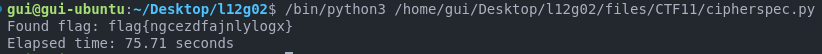

# CTF 8 - Week 11 - Weak Encryption

## Introduction

In this CTF challenge, we were given a [Python ciphersuite](/files/CTF11/cipherspec.py) that uses the AES cipher in CTR mode to encrypt and decrypt messages. The script has a vulnerability that we need to exploit to find the flag. We were also given a [file](/CTF11_L12G02.cph) containing the nonce used to encrypt the message, and the ciphertext itself (both in hexadecimal format, 16 bytes and 22 bytes long, respectively).

## Task 1 - Finding and exploiting a vulnerability

### Analyzing the ciphersuite

As per the guidelines, we started by analyzing the [cipherspec.py](/files/CTF11/cipherspec.py) file:

#### `gen()` function

This function creates a 16-byte (specified by the `KEYLEN` variable) key, where only the last 3 bytes are random. This is a vulnerability, as we'll see below.

```python
KEYLEN = 16

def gen():
  offset = 3 # Hotfix to make Crypto blazing fast!!
  key = bytearray(b'\x00'*(KEYLEN-offset))
  key.extend(os.urandom(offset))
  return bytes(key)
```

#### `enc()` function

This function uses the AES cipher in CTR mode to encrypt the message, using a key `k` (generated by `gen()`, according to the guidelines) and a nonce (a random number 16-byte (128-bit) number that should be used only once per message).

In more detail, the function creates a `Cipher` object using the AES algorithm and the CTR mode, then creates an `encryptor` object using the `Cipher` object, and finally encrypts the message using the encryptor object into the initialized empty byte string `cph`. The encrypted message is then returned.

```python
def enc(k, m, nonce):
  cipher = Cipher(algorithms.AES(k), modes.CTR(nonce))
  encryptor = cipher.encryptor()
  cph = b""
  cph += encryptor.update(m)
  cph += encryptor.finalize()
  return cph
```

#### `dec()` function

This function follows the exact same logic as the `enc()` function, but decrypts the message instead (using the same key and nonce).

```python
def dec(k, c, nonce):
  cipher = Cipher(algorithms.AES(k), modes.CTR(nonce))
  decryptor = cipher.decryptor()
  msg = b""
  msg += decryptor.update(c)
  msg += decryptor.finalize()
  return msg
```

**Question 1:** How can I use this ciphersuite to encrypt and decrypt data?

**Answer 1:** The process starts by generating a key using the `gen()` function. Then, we can encrypt a message using the `enc()` function, passing the key, the message, and a nonce as parameters. A way of generating the nonce isn't detailed in the ciphersuite, but it must be relatively long so that it is unique per each message encrypted (naturally, reusing the same nonce with the same key also compromises confidentiality, as we'll see below). To decrypt the message, we use the `dec()` function, passing the key, the ciphertext, and the same nonce used for encryption.

**Question 2:** How can I use the vulnerability I've observed to break the code?

**Answer 2:** The problem with the `gen()` function is that only the last 3 bytes are random, while the first 13 bytes are all zeroes. As the code comment suggests, it does make the encryption faster, but it also makes it way easier to break, because the key is not fully random and it has a predictable pattern. The lack of randomness in the key is the vulnerability we will exploit through a brute-force attack, because we only need to find the last 3 bytes, which means, we need to try **256^3 == 16777216 possibilities**. In the worst case that is done in **490.19 seconds**, which is a perfectly feasible amount of time. If the key was properly generated, there would be **256^16 == 3.4028237 × 10^38 possibilities**, which, using today's technology, is far too computationally expensive, and therefore time-consuming, as we'll see below.

> Note: Timing the brute-force attack was executed in a Dell Latitude 5490 laptop with an Intel® Core™ i5-8350U CPU @ 1.70GHz×8, 16GB RAM, running Ubuntu 20.04.5 LTS. Naturally, the time will be lower in a more powerful computer, or through the use of parallel computation. Therefore, it is just an estimate, but it serves to show that it is possible to break the key in a reasonable amount of time.

## Exploiting the vulnerability

**Question 3:** How can I automate this process, so that my attack knows it has found the flag?

**Answer 3:** We can automate the process by trying all possible combinations of the last 3 bytes of key (since the first 13 are zeros), and checking for each key possibility if the message decrypted using that key contains a string with `flag{` at the start, and `}` at the end of the flag.

Here's the code that follows this logic:

```python
def find_flag():
  nonce = unhexlify("7fd84ef196cd4c9cb16560524326a325")
  ciphertext = unhexlify("8d4f1b53b6ec30d878a2a368653202b035cf764d1ad0")
  start_time = time.time()

  offset = 3
  for i in range(256**offset):  # 256^3 possible combinations for the 3 bytes
    key = bytearray(b'\x00'*(KEYLEN-offset))
    key.extend(i.to_bytes(offset, 'big'))  # Fill the rest of the key with the 3 bytes

    decrypted = dec(bytes(key), ciphertext, nonce)
    try:
      decoded_msg = decrypted.decode('utf-8')
      if decoded_msg.startswith("flag{") and decoded_msg.endswith("}"):
        print(f"Found flag: {decoded_msg}")
        print(f"Number of iterations: {i+1}")

        end_time = time.time()
        elapsed_time = end_time - start_time
        print(f"Elapsed time: {elapsed_time:.2f} seconds")

        return decoded_msg
    except UnicodeDecodeError:
      # To not crash when bytes are not decodable to UTF-8
      pass
  return None

find_flag()
```

> Note 1: Used the `unhexlify()` function to convert the hex strings to bytes, as per the guidelines.
>
> Note 2: Added `time.time()` variable to measure the time it takes to find the flag. It was also used to measure the worst-case scenario's time, provided a very small code modification.
>
> Note 3: Added a try-except block to avoid crashing when a byte is not valid utf-8 (exception thrown by `decoded_msg.decode('utf-8')`)

Upon running this code, after **71.18 seconds** we found the flag: `flag{ngcezdfajnlylogx}`. We submitted it in the CTF platform and completed the challenge!



Image 1: `find_flag()`'s function output

## Task 2 - 10-Year-Secure Offset Size for Key Generation

**Question 1:** How large would the offset in [cipherspec.py](/files/CTF11/cipherspec.py) have to be to make it impossible for the personal machines used in the attack to discover the key in the worst case, over a period of 10 years? Evaluate experimentally how many you can test in a short period, and use that to calculate how many you could test in 10 years (you can ignore parallelization).

**Answer 1:** Using the data previously gathered by running the code in our machine:

- We can test **2433541 possibilities** (the number of iterations for the value of the last 3 bytes between 0 and 256^3) in **71.18 seconds**. This means we can test **2433541 / 71.18 == 34188,550154538 possibilities per second**.
- To confirm this value, we can test **256^3 == 16777216 possibilities** in **490.19 seconds**. This means we can test **16777216 / 490.19 == 34225.945041719 possibilities per second** (roughly the same rate as above).

Thus, we can extrapolate how many possibilities we could test in 10 years:

So, in **10 years** we could test **34225.945041719 × 10×365.25×24×60×60 == 1.080088683 × 10^13 possibilities**. To make it impossible for the personal machines used in the attack to discover the key in the worst case, over a period of 10 years, we need to find an offset that makes the number of possibilities greater than **1.080088683 × 10^13** (**256^n > 1.080088683 × 10^13** <=> **n > 5.41202**). Therefore, the offset would have to be at least 6 bytes long (**256^6 == 2.814749767 × 10^14 possibilities**).

> Note 1: `365.25` is used to account for leap years.
>
> Note 2: Again, it is important to note that the number of possibilities per second is not constant, and it may vary depending on the machine used. However, the value obtained is a good estimate for the purpose of this task.

This corroborates our previous analysis, where we concluded that a properly generated 16-byte key would be too computationally expensive to break, given today's technology.

## Task 3 - Effectiveness of Unknown 1-byte Nonce

**Question 1:** The author of this optimization had another 'brilliant' idea. Use the nonce with a size of 1 byte and don't send it over the network! This would force the adversary to test all 2^8 possibilities for each possible key in order to conduct the attack. Explain how this is not an effective countermeasure to strengthen the security of these cipher schemes.

**Answer 1:** This measure would lead us to take the following approaches:

- If we want to keep following a brute-force approach, we just need to test all **2^8 possibilities** for each possible key, (resulting in **256^3×256 == 256^4 == 4294967296 possibilities**), which following the same logic as before, would take **4294967296 / 33573.904864822 == 127925.759999998 seconds == 2132.096 minutes == 35.534933333 hours** which is significantly longer than only having to test the possibilities for the last 3 bytes, but still a reasonable amount of time.

- Due to the smaller size of the nonce (in AES it's always 16 bytes (128 bits)), the chances of repeating the same nonce are higher (collisions). That is, because of [how the AES Counter Mode encryption works](/images/CTF11/scheme_CTR_encryption.png), for two different messages, given the same key, the same nonce would generate the same keystream. Furthermore, naturally, the more messages we encrypt with the same key, the higher the chances of repeating the nonce (**birthday paradox**), whose value can only be 256 possibilities. With that information, the attacker can `XOR` two ciphertexts ( **C1 ⊕ C2 == (M1 ⊕ K) ⊕ (M2 ⊕ K) == M1 ⊕ M2**, where the keystream (K) cancels itself ), and if the attacker knows one of the plaintexts, they can find the other one ( **M2 == (C1 ⊕ C2) ⊕ M1 == M1 ⊕ M2 ⊕ M1**, where message1 cancels itself as well). Even if a message is not fully known, the attacker can still find patterns in the plaintext, which leads him to proceed in the same way.

In conclusion, the use of a 1-byte nonce that is not sent over the network is not an effective countermeasure to strengthen the security of these cipher schemes, as it is not only still feasible to break the key in a reasonable time, but it increases the chances of repeating the nonce as well, which is a major vulnerability in the encryption process. These downsides are far greater than the upside of it not being sent over the network and therefore not being intercepted.
