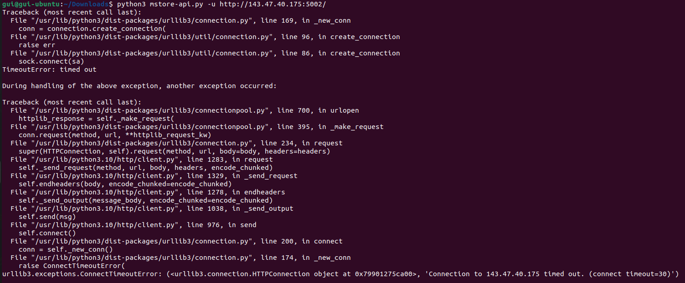

# CTF 1 - Semana 3

## 1. Reconhecimento

Para começar, entramos em `http://143.47.40.175:5001/`, um servidor que hospeda páginas de WordPress, acedemos a todas as páginas disponíveis (e respetivos source codes) e recolhemos as seguintes informações:

- **Versão do WordPress:** 5.8.1 (encontrada tanto na "Additional information " do serviço "WordPress Hosting" à venda pelo utilizador Orval Sanford, como no source code)
- **Versão da MStore API:** 3.9.0 (encontrada na "Additional information" do serviço "WordPress Hosting" à venda pelo utilizador Orval Sanford)
- **Versão do plugin WooCommerce:** 5.7.1 (encontrada tanto na "Additional information" do serviço "WordPress Hosting" à venda pelo utilizador Orval Sanford, como no source code)
- **Versão do plugin Booster for WooCommerce:** 5.4.4 (encontrada na "Additional information" do serviço "WordPress Hosting" à venda pelo utilizador Orval Sanford)

- **Possíveis utiizadores da plataforma:** admin, Orval Sanford

- **Pista adicional:** Vulnerabilidade possivelmente relacionada com a um dos plugins, ao invés da versão do WordPress. O comentário no "serviço WordPress Hosting" feito por Orval Sanford: "My wordpress has been hacked! Don’t buy these instances, they don’t update the wordpress plugins regularly…" levou-nos a considerar esta possibilidade.

## 2. & 3. Pesquisa e escolha da vulnerabilidade

Seguindo o guião, focamo-nos na procura de vulnerabilidades que fizessem alusão à autenticação como administrador ou à exposição de dados de utilizadores (através de SQL Injection, por exemplo).

- Usando [esta](https://cve.mitre.org/) base de dados de CVEs, encontramos imediatamente 3 vulnerabilidades muito semelhantes relacionadas com a MStore API ([#1](https://www.cve.org/CVERecord?id=CVE-2023-2732), [#2](https://www.cve.org/CVERecord?id=CVE-2023-2733), [#3](https://www.cve.org/CVERecord?id=CVE-2023-2734)), estando estas presentes nas versões <=3.9.2, <=3.9.0 e <=3.9.1, respetivamente. Estando todas elas presentes na versão do plugin usado no site, investigamos os seus detalhes:

  - a [vulnerabilidade #2](https://www.cve.org/CVERecord?id=CVE-2023-2733) estava relacionada com os pedidos de uso de coupões através da REST API, que não pareciam estar implementado no site a que tínhamos acesso.
  - a [vulnerabilidade #3](https://www.cve.org/CVERecord?id=CVE-2023-2734) estava relacionada com a pedidos da REST API a partir de dispositivos móveis, não parecendo estar relacionada com o problema apresentado.
  - a [vulnerabilidade #1](https://www.cve.org/CVERecord?id=CVE-2023-2732) estava relacionada com os pedidos da REST API de listagem de um artigo na loja online, que parecia mais plausível tendo em conta a natureza do site.

- Sendo assim, como o guião nos indicou, procuramos por um exploit desta vulnerabilidade, que sabíamos que teria de existir, ou não seria a vulnerabilidade correta. Não encontrando um exploit - tendo descoberto depois que foi devido à pesquisa ter sido feita no Bing - e não querendo apresentar a resposta errada no Desafio CTF, continuamos a procurar.
- Encontramos uma [vulnerabilidade muito plausível](https://www.cve.org/CVERecord?id=CVE-2021-34646) no plugin Booster for WooCommerce, mas que tinha sido corrigida na exata versão que estava a ser utilizada pelo site (5.4.4). Continuamos a pesquisar, optando por utilizar [outra](https://www.cvedetails.com/) base de dados com um método de pesquisa que nos permite muito mais facilmente encontrar todas as vulnerabilidades que afetam certa versão de um software ([WordPress](https://www.cvedetails.com/vulnerability-list/vendor_id-2337/product_id-4096/version_id-1582428/), [MStore API](https://www.cvedetails.com/vulnerability-list/vendor_id-22860/product_id-81070/version_id-1106151/), [WooCommerce](https://www.cvedetails.com/vulnerability-list/vendor_id-16011/product_id-35474/version_id-1725911/Woocommerce-Woocommerce-5.7.1.html), [Booster for WooCommerce](https://www.cvedetails.com/vulnerability-list/vendor_id-21937/product_id-70583/version_id-837221/Booster-Booster-For-Woocommerce-5.4.4.html))
- Acabamos por pesquisar acerca da [vulnerabilidade #1](https://www.cve.org/CVERecord?id=CVE-2023-2732) novamente (agora no Google), tendo encontrado um exploit funcional, e completamos a 1ª parte do Desafio CTF ao submeter `flag{CVE-2023-2732}`.

## 4. & 5. Encontrar um exploit e explorar a vulnerabilidade

Ao procurar no Google por "CVE-2023-2732 exploit" encontramos dois repositórios com código que permitia utilizar esta vulnerabilidade:

- Ambos os códigos seguem o mesmo princípio, embora o [segundo repositório](https://github.com/ThatNotEasy/CVE-2023-2732) possa dar exploit da vulnerabilidade em vários URLs ao mesmo tempo percorrendo um ficheiro .txt. Referente ao [primeiro repositório](https://github.com/RandomRobbieBF/CVE-2023-2732), ao executar o ficheiro adicionando "-u" ou "-url", e, de seguida, o URL do site do WordPress, o exploit determina a versão do plugin aplicado. Se o README do plugin mencionar que a versão for menor 3.9.3, então retorna uma lista de utilizadores através da REST API, fazendo um pedido GET para "/wp-json/wp/v2/users". De seguida, o código imprime a lista de utilizadores e pede-nos para escolher um. Com o ID do admin, o exploit consegue fazer um pedido GET para "/wp-json/wp/v2/add-listing" com esse ID, verificando o sucesso através do cookie "wordpress_logged_in_". Finalmente, podemos visitar [site]/wp-json/wp/v2/add-listing?id=[id_do_admin] e deveremos estar com a sessão iniciada no site.

- Ao executar o código do [primeiro repositório](https://github.com/RandomRobbieBF/CVE-2023-2732), ocorria um erro de comunicação ao servidor. Por isso, tentamos executar o código do [segundo repositório](https://github.com/ThatNotEasy/CVE-2023-2732), tendo também obtido um erro de comunicação.

Figura 1: Erro de comunicação ao executar código [primeiro repositório](https://github.com/RandomRobbieBF/CVE-2023-2732)

-Foi entretanto anunciado que a firewall interna da rede da FEUP poderia estar a causar problemas.

- Ao utilizarmos uma Wi-Fi diferente, ambos os códigos executaram sem problemas. Como indicavam os exploits:
  - Visitamos o URL que faz um pedido de uma nova listagem, fazendo-se passar por admin (cujo ID é 1): `http://143.47.40.175:5001//wp-json/wp/v2/add-listing?id=1`
  - Retornamos ao site original, estando agora autenticados como o utilizador admin: `http://143.47.40.175:5001/`
  - Esta permissão mais elevada deu-nos acesso a uma mensagem privada que continha a flag para completar o Desafio CTF: `flag{byebye}`
