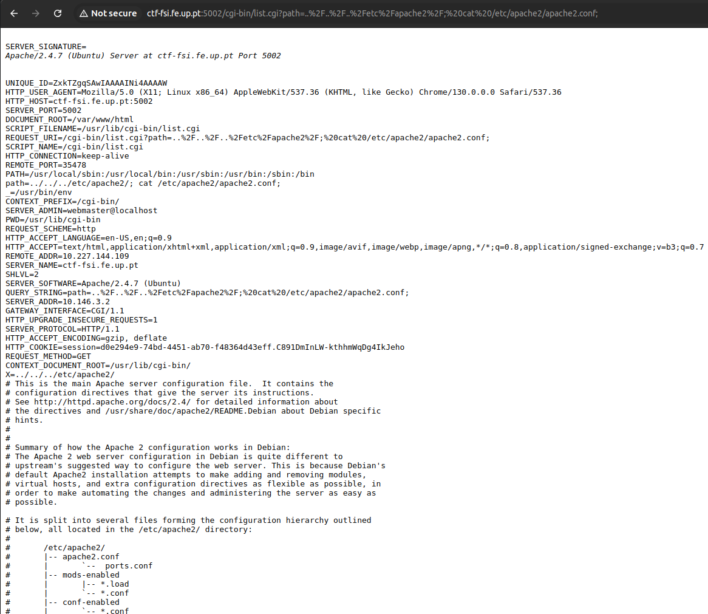

# CTF 2 - Week 4 - Environment Variables

## Reconnaissance

We accessed the web server at `http://ctf-fsi.fe.up.pt:5002`, and immediately realized it was related to the shell, due to its header and footer mentioning the shell over and over ("Hard as a Shell", shell emojis), even redirecting to a page with more of those mentions and an ASCII art of the Shell oil company. So that could be one of the clues to find the vulnerability.

Additionally, the website's search bar indicated that we could browse any path in the server by inputting the respective path. The server executes `ls -al` on the path we input through a `CGI` script (as evidenced by the URL, for example: `http://ctf-fsi.fe.up.pt:5002/cgi-bin/list.cgi?path=%2F`), and returns the output to the user (listing of all that directory's contents, including hidden ones, and their respective permissions).

Other than that, the web server's main page included information about all the installed software, but that wouldn't do much to narrow down the search for the vulnerability.

## Researching and choosing the vulnerability

By typing "shell vulnerability" into the Google search bar, the first result was the [Shellshock bug Wikipedia page](<https://en.wikipedia.org/wiki/Shellshock_(software_bug)>) that mentioned the possibility to "... cause the Bash to execute arbitrary commands and gain unauthorized access to many Internet-facing services, such as web servers, that use Bash to process requests".

We inspected the initial vulnerability - [CVE-2014-6271](https://cve.mitre.org/cgi-bin/cvename.cgi?name=CVE-2014-6271) - that reported the Shellshock bug on 12 September 2014, as well as 5 other closely related vulnerabilities which followed it a few days after ([CVE-2014-6277](https://cve.mitre.org/cgi-bin/cvename.cgi?name=CVE-2014-6277), [CVE-2014-6278](https://cve.mitre.org/cgi-bin/cvename.cgi?name=CVE-2014-6278), [CVE-2014-7169](https://cve.mitre.org/cgi-bin/cvename.cgi?name=CVE-2014-7169), [CVE-2014-7186](https://cve.mitre.org/cgi-bin/cvename.cgi?name=CVE-2014-7186) and [CVE-2014-7187](https://cve.mitre.org/cgi-bin/cvename.cgi?name=CVE-2014-7187)). Through this, we realized that all GNU Bash versions up to 4.3 were affected by all the mentioned vulnerabilities.

Focusing on the initial vulnerability ([CVE-2014-6271](https://cve.mitre.org/cgi-bin/cvename.cgi?name=CVE-2014-6271)), it reports on the fact that the GNU Bash processes trailing strings in the definitions on environment variables, allowing attackers to execute arbitrary code via those defined variables. This is because the user input passes values to environment variables (for example, the `path` variable, as shown below), occurring what is referred to as "crossing a privilege boundary", which is passing data from an untrusted source (for example, the user) to a trusted process (like a system script on the web server), effectively giving the user privileges that they shouldn't have.

We verified that this web server was possibly vulnerable to this CVE, due to it being an Apache server, as indicated by the installed packages on the main page of the web server, which was one of the attack vectors described in the [CVE](https://cve.mitre.org/cgi-bin/cvename.cgi?name=CVE-2014-6271).

Similarly to [Task 8 of LOGBOOK4](/LOGBOOK4.md#task-8-invoking-external-programs-using-system-versus-execve), we tried to exploit the vulnerability by injecting commands both into the URL and on the input box (which worked in the exact same way), such as `/; pwd;`, to see if they would run, we got the following output:

Image 1 - Output after injecting `pwd` command

It outputted the environment variables (followed by the output of `pwd` and `ls -al /`). With this information, we confirmed it was an Apache server (version 2.4.7, in the `SERVER_SIGNATURE` variable), as well as the execution of these commands through the CGI script (`list.cgi` in the `SCRIPT_NAME` variable), which was another attack vector described in the CVE.

The fact that the `path` variable contained the input we provided (`/; pwd;`), and that we got the output to those commands, we got very strong proof that the server was vulnerable to the Shellshock bug, as per its description.

Considering the clues we gathered, and to not repeat past mistakes of neglecting a correct vulnerability due to the difficulties working with the exploit, we tried `flag{CVE-2014-6271}` and completed the 1st part of the CTF challenge.

## Finding an exploit and exploiting the vulnerability

As this is an extremely well-known vulnerability, by searching "cve-2014-6271 exploit", a lot of exploits are easily found, especially when adding "site:github.com" to the end of the search string. A few of them are:

- [exploit-CVE-2014-6271](https://github.com/opsxcq/exploit-CVE-2014-6271)
- [CVE-2014-6271-Shellshock](https://github.com/MY7H404/CVE-2014-6271-Shellshock)
- [CVE-2014-6271](https://github.com/b4keSn4ke/CVE-2014-6271)

But as mentioned before, after a lot of tries, we couldn't get any of them to work. This, coupled with the inconsistent availability of the web server, led us to brute-force our way to the flag, by injecting commands such as the `cd` on the URL to navigate the server's file system, and `cat` to get the contents of the files:

Image 2 - Excerpt of output after injecting `cd` and `cat` commands to access the content of `/etc/apache2/apache2.conf` file

Luckily, after searching through a few directory trees, we managed to find the flag in the `/var/flag/flag.txt` file, which we outputted with `cat`: `flag{nepRv5p2brjkL7c7Z4l3tMMq6T1mgO}`. Thus, we completed the 2nd part of the CTF challenge.

## Alternative, more efficient solution

After discussing other possible options to exploit this vulnerability, that didn't involve brute-force, our practical class's professor mentioned the `grep` command, which we injected into the URL as `grep -r "flag{" .`, which, after a few moments of processing, gave the following output (where `:0` after the path means the files doesn't match the search and `:1` means it does):

Image 3 - Output after injecting `grep` command to find the flag

After using `cat` to get the contents of this file, we got the following flag:

Image 4 - Flag found with `cat` command: `flag{C0aVBzSKTzm7UDwLLLvLxz04TMMSj1}`

Which means that, at the time of writing and when Image 4 was taken, the flag has changed.
