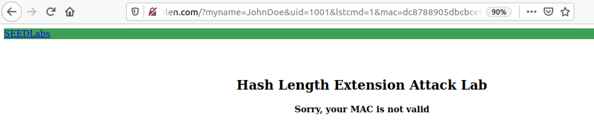
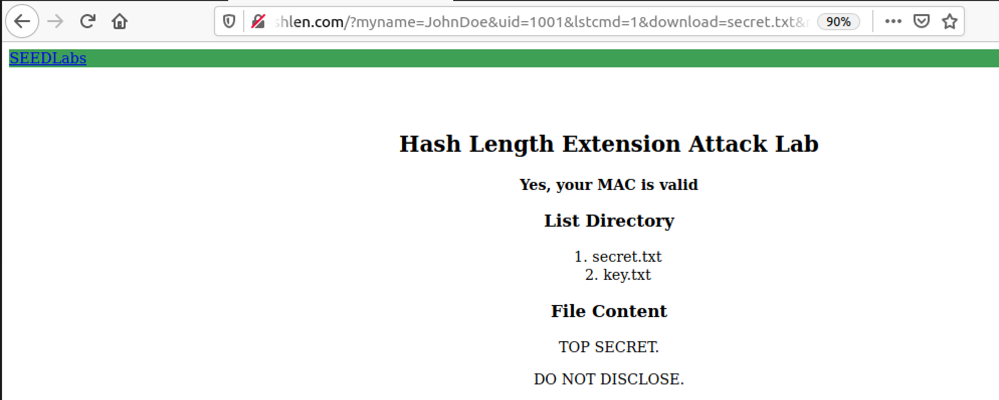
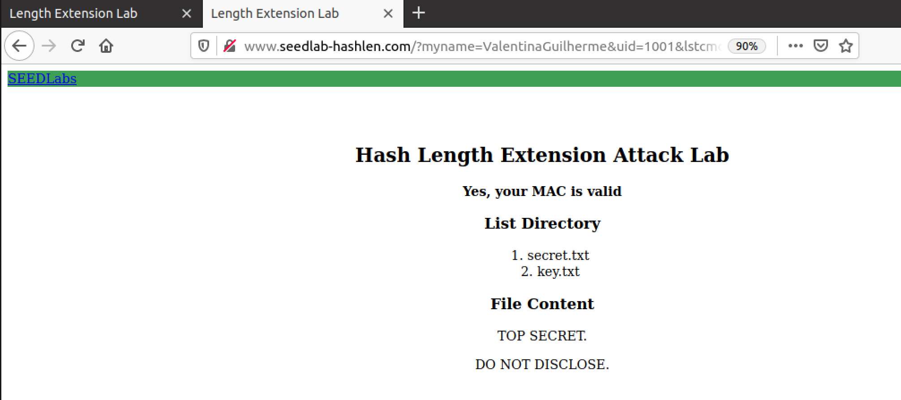
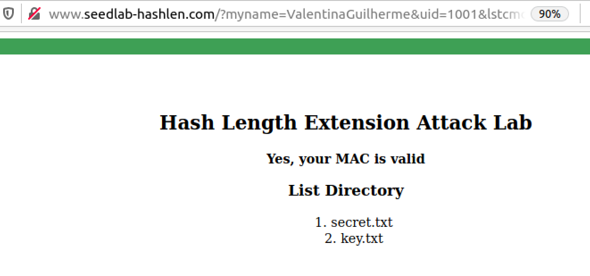
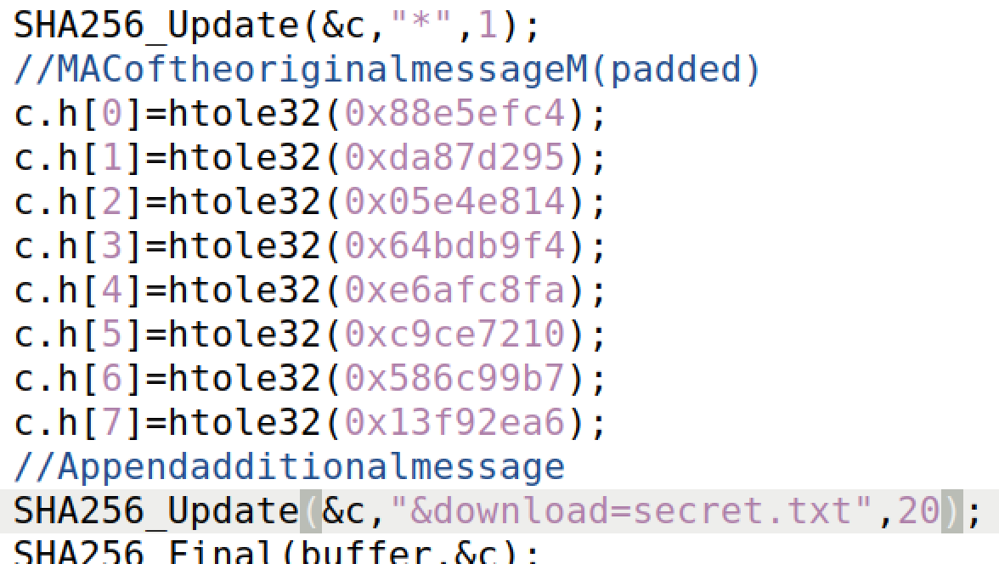
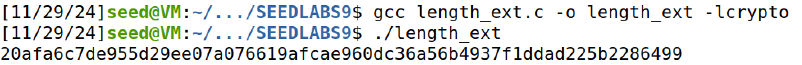
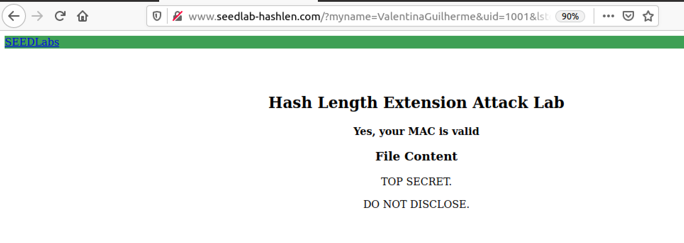

# SEED Labs Tasks for _Hash Length Extension Attack Lab_

## General Information

In this week, we understood how a vulnerable MAC tag may lead an attacker to modify the original request sent by the user. Using a server program, we attacked it using valid comments, which made us access sensible data.

## (Work done in Week #10)

#### 1º Start the server

Before starting the attacks, we need to run the server program where our attack will be succeeded. We checked if the `10.9.0.80 www.seedlab-hashlen.com` is inside `/etc/hosts` file, so that we can access the correct server. After, We made `dcbuild` instead of `docker-composebuild` to build an environment container, and `dcup` instead of `docker-composeup` to start the container. These aliases are inside .bashrc file.

In another terminal, we made `dockps`, alias for docker ps, and saw that only one host was available: `5e0dc9dbbebe  www-10.9.0.80` . Thus, we did `docksh 5e`, leading to a successfull connection to the server.

We verified the connection by entering the first url provided `http://www.seedlab-hashlen.com/?myname=JohnDoe&uid=1001&lstcmd=1&mac=dc8788905dbcbceffcdd5578887717c12691b3cf1dac6b2f2bcfabc14a6a7f11`.



Even though the correct website was displayed, the answer we obtained was that the request failed due to the MAC. However, when trying the second url, which has the additional variable - download - it seemed to be working just fine:


By doing http://www.seedlab-hashlen.com/?myname=JohnDoe&uid=1001&lstcmd=1&download=secret.txt&mac=dc8788905dbcbceffcdd5578887717c12691b3cf1dac6b2f2bcfabc14a6a7f11.


As we can see in the previous picture, 2 types of content show up after the verification of the MAC. Each content is the result of the respective command inserted in the request:
 - lstcmd=1 -> requests the server to list all the files in the LabHome folder. This folder holds all the sensitive files and Information such as the possible uids, keys for computing the MAC.
 - download=file.txt -> reuqests the server to preview the contents of a file inside LabHome folder.

With these commands, an attacker can easily change the request by knowing the correct uid and key to formulate a new MAC.

## Task 1: Send Request to List Files

To successfully change a request, we have to understand how to fill it. First we add the user name and an uid that has access to the request, then the commands we purposedly want the server to execute, and finally the MAC. The MAC depends on the key of each uid, concatenated with the previous parameters. To have a more secure MAC, the server uses sha256sum encryption to encode the MAC.

> Note: Although the server doesn't use the myname variable to verify the authenticity of the request, it was recommended to use our name instead of JohnDoe to avoid conflicts of copywrite between groups. As such, MAC will change according to the names of each group.

In this task, it was necessary to send a download request. So all we had to do was fill correctly the parameters of the following template:

`http://www.seedlab-hashlen.com/?myname=<name>&uid=<need-to-fill>
 &lstcmd=1&mac=<need-to-calculate>`

But we need to add after the lstcmd command the download command, switch myname to ValentinaGuilherme, uid to 1001 and MAC to the result of:

```sh
 echo-n "123456:myname=ValentinaGuilherme&uid=1001&lstcmd=1&download=secret.txt" | sha256sum
```
123456 being the key of the used uid in the request.

The final link would be:

`http://www.seedlab-hashlen.com/?myname=ValentinaGuilherme&uid=1001&lstcmd=1&download=secret.txt&mac=3158561c25d414d6ba4609e2036b01db29f105e94c918e4d5aa3914392470cb0`

Which returns positive:



We can also do only with lstcmd, using the link:
`http://www.seedlab-hashlen.com/?myname=ValentinaGuilherme&uid=1001&lstcmd=1&mac=88e5efc4da87d29505e4e81464bdb9f4e6afc8fac9ce7210586c99b713f92ea6`




## Task 2: Create Padding

To better understand how the hash length extension attack will work, we first need to complete one of its steps: create a padding for the message that will be sent by the request. 
In this task, we have to create padding for the MAC based on SHA-256. According to RFC 6234, the padding size in bytes must be multiple of 64. Besides that, it needs to follow these steps:
 1) The first byte be \x80
 2) Add 0s until the padding length reaches a multiple of 64 bytes
 3) the length of the message in bits

The message we have to create the padding for will be the same as the last task:
`123456:myname=ValentinaGuilherme&uid=1001&lstcmd=1`

#### Creation of the padding based on the steps:

 Step 1 - One cool fact about the message is that it's composed of exactly 50 chars, which is 50 bytes in total. Knowing we need an input of size multiple of 64 bytes, then we can achieve this by doing a input of 64 bytes using the message (50 bytes) and a small padding. Thus, the padding will be 64 - 50 bytes, which is 14 bytes. Since \x80 is 1 byte then 13 bytes are left for step 2 and 3.

 Step 3 - The length of message in bits is 8bits * 50bytes = 400 bits in base 10 or 0x190 in binary. Since the length occupies more than one byte, we can write is as \x01\x90, following the Big-Endian byte order, which, in this case, is required for the length field.

 Step 2 - All its left is to get the number of zeros between step 1 and step3. As 13 Bytes were left before doing step 3, and step 3 took 2 bytes, we can conclude that we will need 13-2 = 11 bytes full of 0s. In other words \x00\x00\x00\x00\x00\x00\x00\x00\x00\x00\x00.

If we glue the results of each step we obtain the padding for the required message:

`\x80\x00\x00\x00\x00\x00\x00\x00\x00\x00\x00\x00\x01\x90`

Nevertheless, the task isn't finnished: we can't insert bynary code into the URL without enconding it first. Luckily, all we have to do is transform `\x` to `%`.

In the end, the padded message (the message with the padding added at the end) will be:

`123456:myname=ValentinaGuilherme&uid=1001&lstcmd=1%80%00%00%00%00%00%00%00%00%00%00%00%01%90`


## Task 3: The Length Extension Attack

Having all the tools required to execute the attack, we can finally generate a valid MAC for a URL without knowing the MAC key.

>Note: This is important because it shows us that the attacker can deliberily execute commands without alarming the server. This is done by changing a valid request. Of course, the attacker doesn't have the knowledge of what the keys for the user of the original request are, yet its possible to have a successfull attack.

The exploit is simple. If we know a valid MAC and its respective message, we can extend the message with the padding and our malicious command, to trick the server that the valid MAC after few alterations is still a valid MAC. The code presented in the guide presents how easy it is to create a new MAC:

```c
...
 //MAC of the original message M (padded)
 c.h[0]=htole32(0x6f343800);
 c.h[1]=htole32(0x1129a90c);
 c.h[2]=htole32(0x5b163792);
 c.h[3]=htole32(0x8bf38bf2);
 c.h[4]=htole32(0x6e39e57c);
 c.h[5]=htole32(0x6e951100);
 c.h[6]=htole32(0x5682048b);
 c.h[7]=htole32(0xedbef906);
 //Append additional message
 SHA256_Update(&c,"Extra message",13);
 SHA256_Final(buffer,&c)
...
```

Basically we store each ith 8 byte of the bening MAC in c.h[ith]. Since MAC has 64 bytes, then we will have 8 parts of 8bytes length. Then we had the extra message to the code. Ultimately, we obtain the new malicious MAC with the correct SHA-256 already done.

The bening request we want to exploit is from the first task:
`http://www.seedlab-hashlen.com/?myname=ValentinaGuilherme&uid=1001&lstcmd=1&mac=88e5efc4da87d29505e4e81464bdb9f4e6afc8fac9ce7210586c99b713f92ea6`

We want it to be able to download the secret text file.

#### The MAC:

For that, we obtain the bening MAC and split it into 8 parts:

The original MAC:

```88e5efc4da87d29505e4e81464bdb9f4e6afc8fac9ce7210586c99b713f92ea6```

The origianl MAC after splitted into the 8 parts:
```0x88e5efc4 
0xda87d295 
0x05e4e814
0x64bdb9f4
0xe6afc8fa
0xc9ce7210
0x586c99b7
0x13f92ea6
```

The malicious message we want to add is `download=secret.txt` that has 20 bytes.

In summary the code will be:



If we compile the code and run it, we get the malicious MAC: `20afa6c7de955d29ee07a076619afcae960dc36a56b4937f1ddad225b2286499`



#### The URL:

At last, we can create the malicious URL: 

The template used:
`http://www.seedlab-hashlen.com/?myname=<name>&uid=<uid>&lstcmd=1<padding>&download=secret.txt&mac=<new-mac>`

The result: a successfull attack :)

`http://www.seedlab-hashlen.com/?myname=ValentinaGuilherme&uid=1001&lstcmd=1%80%00%00%00%00%00%00%00%00%00%00%00%01%90&download=secret.txt&mac=20afa6c7de955d29ee07a076619afcae960dc36a56b4937f1ddad225b2286499`



Using this method, we can obtain any file, even if it means sensitive data on a secret.txt file. This can be expanded onto executing different and more dangerous commands, if any website has this vulnerability.