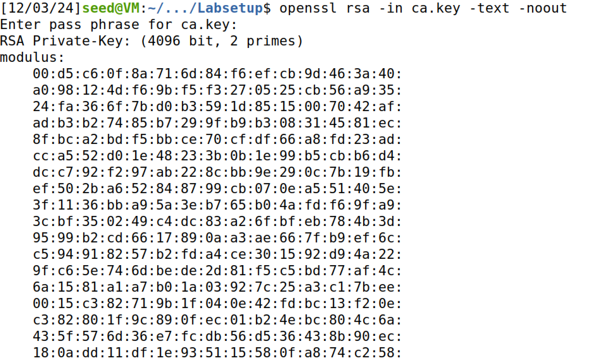
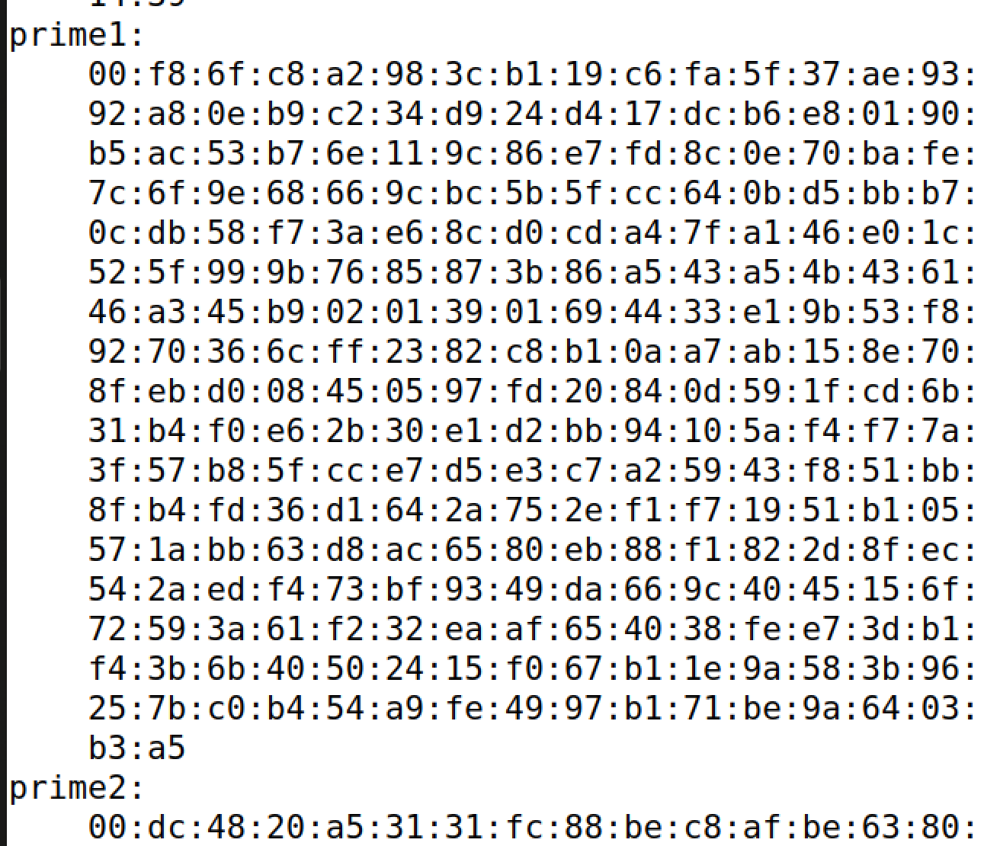
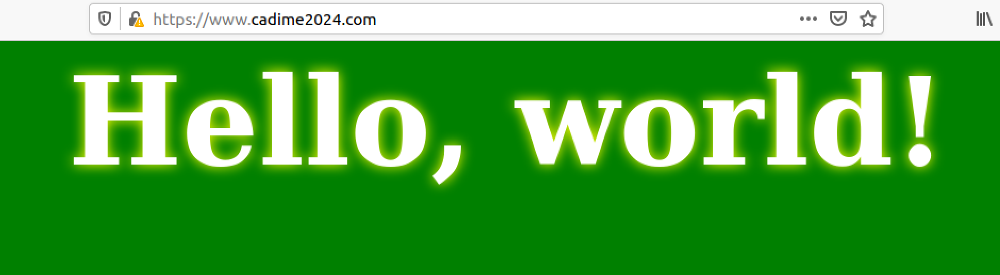
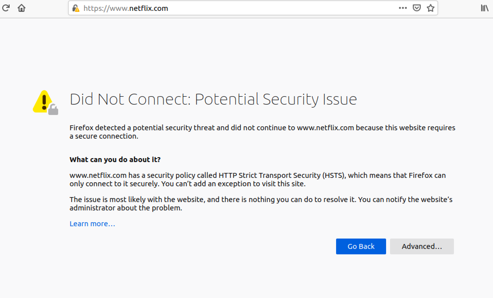

# SEED Labs Tasks for _Hash Length Extension Attack Lab_

## General Information

In this week, we dove into the world of Public Key Infrastructure, also known as PKI. PKI is a solution to verify the ownership of a public key. Essentially, it helps us avoid trust issues and Man-in-the-middle attacks in any platform that uses public keys like softwares, web browsers, and most operating systems. Besides, we understood what is a Certifice Authority (CA) and a root CA. 

## (Work done in Week #11)

#### 1º Start the server

Before starting the attacks, we need to run the server program where our attack will be succeeded. We created 2 server names inside `/etc/hosts` file:
 - the `10.9.0.80 www.bank32.com`, which is necessary, so that the example in the lab description works.

 - a server with our names and the current year of the lab project, so that we can do the next tasks. In our case, we added `10.9.0.80 www.cadime2024.com` in the file.
 
After, We made `dcbuild` instead of `docker-composebuild` to build an environment container, and `dcup` instead of `docker-composeup` to start the container. These aliases are inside .bashrc file.

In another terminal, we made `dockps`, alias for `docker ps`, and saw that only one host was available: `5588165c11ba  www-10.9.0.80` . Thus, we did `docksh 5`, leading to a successfull connection to the server.


## Task 1: Becoming a Certificate Authority (CA)

A certificate Authority is a trusted entity that issues digital certificates, which connect a public key to a named subject who is willing to certify their ownership. However, most of the time, to obtain a digital certificate, we are require to pay to any commercial CA. Therefore, in this logbook, we created a certificate by becoming a root CA ourselves, and, then issuing ourselves the certifcate. A root CA, is the highest ranking authority in a PKI, where its certificate is self signed and it can issue certificates for others (e.g. servers).

In order to become a root CA ourselves, we need to configure few files before running a command.

 #### 1) Obtain the openssl.conf
 
 Usually with extension `.cnf` - from /usr/lib/ssl/openssl.cnf. This file will have the configuartions required for OpenSSL to create certificates. The commands that use openssl.cnf are `ca`,`req` and `x509`. We can copy the file to the current directory using a cp command.


>Note When we copy this way, we obtain a read-only file. This can be manageable by creating a new file with the same name and content.

In this file we remove the # from the line `#unique_subject = no` to allow the creation of certificates with the same subject.

 #### 2) Create index.txt

In the same directory we added the openssl.cnf, we need to create an empty file name "index.txt". It will be the database index file, as per mentioned in the `openssl.cnf` comments.

 #### 3) Create serial

In the same directory we added the openssl.cnf, we need to create a file name "serial" with a single number in string format (e.g. 1000), to represent the current serial number.

#### 4) Run the command
After all files are created, we can create and issue certificates. For starters, we need to generate a self-signed certificate (root certificate) for our CA, which shows that this CA is 100% trusted. The command to generate the self-signed certificate for the CA is the following:

```sh
openssl req-x509-newkey rsa:4096-sha256-days 3650 -keyout ca.key-out ca.crt
```

The result will be a new CA self-signed certificate. Though, we have to fill some details of our CA to have it signed. The most important input will be the password, since we need to use it whenever we have to sign certificates for others.


Another way to create the certificate could be:

```sh
openssl req-x509-newkey rsa:4096-sha256-days 3650 \-keyout ca.key-out ca.crt \-subj "/CN=www.modelCA.com/O=Model CA LTD./C=US" \-passout pass:dees
```

This command specifies the subject information and password in the command line, where `use-subj` is used to set the subject information and `use-passout pass:dees` to set the password to dees.

#### 5) Verify the certificate

To check if the certificate was create properly we can use these commands to observe the decoded content of the X509 certificate and the RSAkey. These commands will have:

 - -text : to decode the content into plain text
 
 - -noout : to not print the encoded version

```sh
 openssl x509-in ca.crt -text -noout
```

```sh
 openssl rsa-in ca.key -text -noout
```

#### What part of the certificate indicates this is a CA’s certificate?

If we look through the second picture of openssl x509-in command, and look past the x509v3 extensions, we see that the certificate authority is True:

```sh
...
x509v3 Basic Constraints: critical
    CA: TRUE
...
```


#### What part of the certificate indicates this is a self-signed certificate?

In the first part of the openssl x509-in command, we see that the Issuer and Subject fields are identical, which indicates that the certificate is self-signed. In other words, the entity that issued the certificate is the same as the one who wants the certificate.


#### In the RSAalgorithm, we have a public exponent e, a private exponent d, a modulus n, and two secret numbers p and q, such that n = pq. Please identify the values for these elements in your certificate and key files.

All the elements mentioned are inside the RSAkey:


The modulus n, is the first thing to be printed:


Then the public exponent e and the private exponent d follow the modulus:


The 2 secret secret numbers p and q that form n are mentioned as prime1 and prime2. We also get more information after the prime numbers like exponents and coefficient.




## Task 2: Generating a Certificate Request for Your Web Server
On this task we have to send a CSR request to the root CA, as if we were from the company of `www.cadime2024.com` and wanted a public key certificate. The Certificate Signing Request (CSR) ensures we give our identity information along with the company’s public key, so that the CA can verify the information, and issue a certificate.

The command to generate a CSR is exactly the same as in task one, except we have to remove the -x509 option. This option indicates if we want to issue to someone else or sel-sign a certificate. The command will be the following:

```sh
openssl req -newkey rsa:2048-sha256 -keyout server.key -out server.csr -subj "/CN=www.cadime2024.com/O=Cadime24 Inc./C=US" -passout pass:valido
```


We can see the result by executing the commands:

```sh
openssl req-in server.csr -text -noout
```


```sh
openssl rsa-in server.key -text -noout
```


Alternatively, websites often use multiple URLs (e.g., www.example.com, example.com). Nevertheless, the browsers require the hostname in a certificate to match the server’s hostname. Therefore, to handle multiple names, the X.509 standard includes the Subject Alternative Name (SAN) extension, allowing multiple hostnames in the subjectAltName field. To create a certificate with SANs, you can add the required names via a configuration file or the command line. 

> Note: the subjectAltName extension field must include the common name, otheriwse the name won’t be accepted as valid.

```sh
openssl req -newkey rsa:2048-sha256 -keyout server.key -out server.csr -subj "/CN=www.cadime2024.com/O=Cadime24 Inc./C=US" -passout pass:valido -addext "subjectAltName = DNS:www.cadime2024.com, DNS:www.cadime2024A.com, DNS:www.cadime2024B.com"
```


## Task 3: Generating a Certificate for your server

The certificate request the company sent to our CA needs to be generated. The signing request (server.csr) will become an X509 certificate (server.crt), using the CA’s ca.crt and ca.key in the next command.

> Note: having a folder named demoCA with the index.txt and serial file is required for this task.

> Note2: The default openssl.cnf doesn't allow this command to copy the extension field from the request to the final certificate. Thus, uncomment the line "copy_extensions = copy" of the file is necessary.

```sh
openssl ca-config openssl.cnf -policy policy_anything -md sha256 -days 3650 -in server.csr -out server.crt -batch -cert ca.crt -keyfile ca.key
```

We use the policy_anything policy (not to get confused with the default policy), since it does not enforce any matching rule regarding the subject information in the request versus the one in the CA’s certificate.

Anyway, if we run the following command we will get the result of the signing:

```sh
openssl x509-in server.crt-text-noout
```


## Task 4: Deploying Certificate in an Apache-Based HTTPS Website

After issuing the certificate for `www.cadime2024.com`, we will see how public-key certificates secure web browsing. Beforehand, we need to set up an HTTPS website on Apache. The Apache server we need is already inside the container. This server will support HTTPS protocols. To configure it, we have to specify where will the private key and certificates be located. We will use the examle given for bank32 to set up our own HTTPS site.

The example file for bank32:
```sh
<VirtualHost *:443>
 DocumentRoot /var/www/bank32
 ServerName www.bank32.com
 ServerAlias www.bank32A.com
 ServerAlias www.bank32B.com
 DirectoryIndex index.html
 SSLEngine On
 SSLCertificateFile
 /certs/bank32.crt
 SSLCertificateKeyFile /certs/bank32.key
 </VirtualHost>
```


The file for the company: `cadime2024_apache_ssl.conf`
```sh
<VirtualHost *:443>
    DocumentRoot /var/www/bank32        #location of the  stored website files
    ServerName www.cadime2024.com       # specifies the name of the website
    ServerAlias www.cadime2024A.com    #allows the website to have different names
    ServerAlias www.cadime2024B.com
    DirectoryIndex index.html
    SSLEngine On
    SSLCertificateFile /certs/cadime2024.crt  #location of  server certificate
    SSLCertificateKeyFile /certs/cadime2024.key   #location of private key
</VirtualHost>

<VirtualHost *:80>
    DocumentRoot /var/www/bank32
    ServerName www.cadime2024.com
    DirectoryIndex index_red.html
</VirtualHost>

# Set the following gloal entry to suppress an annoying warning message
ServerName localhost
```

We added the last file in the same directory as bank32, which is located inside the folder named `image_www`. Moreover, sever.crt and server.key were moved inside the certs folder, at `image_www/certs` .

Finally we can run the command inside the conatiner to start the server: `service apache2 start`. It will ask for the password of bank32: `dees`. If put corretcly, we can browse the web site with the traffic between the browser and the server being encrypted.



Of course, we will be redirected to a page describing the connection not being secure, but this can be easily overcome by clicking on "Advanced..." and "Accept the Risk and Continue". This is due to our root CA not being recognized as a trusted authority for the browser.


We can verify this by going to the certificate page that the browser recognizes as trusted. By selecting the ham menu (options menu) and click on "Preferences":


We will see the general preferences. We have to go to "Privacy & Security":


Then, we need to scroll down to the Security section. In the certificates Area, we should click the "View Certificates..."


All the certificates recognized by the browser will be displayed there. However, if we search through the list, we won't be able to see our certificate name.


Hence, we need to click on "Import..." button to insert our certificate, to make our certificate trusted by the browser.


## Task 5:  Launching a Man-In-The-Middle Attack

The goal of this task is to see how PKI will defeat a MITM attacks using our website (created in the last tasks) as the target website. 

Basically, any victim who enters the website is prone to be eavesdropped or impersonated by the perpretator, which will be us. This is because, we will replace the public key, given by the victim in its message, to ours. Normally, the attacker should then forward the message to the server using the original public key, to not raise any suspicion. However, in our case, we won't forward the message, since we will see that the server won't be accessible in the first place.

First we will try to impersonate netflix, since it's a popular website, hence attracting many victims to our mallicious website. To do that, we only need to change the server name we created in this logbook to `www.netflix.com`. The file `etc/apache2/sites-available/cadime2024_apache_ssl.conf` looks like this now:


One thing that is noticeable in the previous image is the fact that the certificate and key are from the previous server name. This will create problems eventually, but the current focus is to emulate an MITM attack. In other words, if we were planning a real attack, the chances of obtaining a valid certificate for our malicious website, `www.netflix.com`, are pretty low - the official website already prooved its authenticity, making us seem suspicious.

Anyway, if we try to connect to this website, it will redirect us to the official website, which we don't want. Since we aren't launching a real DNS cache poisoning attack, we have to modify the `/etc/hosts` file to emulate the result of a DNS cache positing attack by mapping the hostname www.netflix.com to our malicious web server.


After restarting the Apache server using `service apache2 restart`, whenever a victim accesses `www.netflix.com`, they will be redirected to our malicious website - only in our machine, of course. The result will be the following:



It looks like the browser detected a potential security issue, leading to failure in the attack. If we click in `Advanced...` button, we will obtain more details about the reason of the non-successfull attack:


Observing the error, we clearly understand that the problem lies between the certificate and the server name. Ultimately, we are trying to validate our malicious website with a certificate that doesn't belong to it. The original certifcate only is valid for `www.cadime2024.com`, `www.cadime2024A.com` and `www.cadime2024B.com`. It has no mention of the malicious website `www.netflix.com`. Thus, the browser cannot fully trust the site and let the victim enter. Maybe if we had a proper certificate for the malicious website, we could lead the browser, and, consequently, the victims into the bait. We will explore this solution in the next task.

## Task 6:  Launching a Man-In-The-Middle Attack with a Compromised CA

We will imagine that somehow the attacker (us) obtained a compromised root CA, whose private key got stolen. As a result, the attacker can use this advantage to create a valid certificate for the malicious websites since the stolen private key will verify the certificate.  

Let's see what would happen if we emulate the compromised root CA. As such, we will generate a valid certificatefor `www.netflix.com` by writting similar commands from the Task2 in the terminal:


With the correct files generated, we will move them inside the volumes folder and then update the Apache configuration folder:


Restarting the Apache server once more, we can finnaly visit the website with no warnings.


In summary, `www.netflix.com` surpassed the broswer detection, leading to a successfull Man-In-The-Middle attack. Having a compromised root CA, opens a wound into dangerous attacks and making anyone who enteres the malicious websites vulnerable.

## Question 2:
#### Apesar de assumirmos que estas autoridades de certificação são resistentes a ataques, realisticamente, devemos considerar sempre a possibilidade de serem comprometidas. Indique um mecanismo que permita reagir a essa ocorrência e impedir ataques, e que medidas um adversário pode tomar para evitar que esse mecanismo o impeça de tirar partido de uma autoridade de certificação comprometida.

If somehow a Certificate Authority (CA) gets compromised, we need to use fast mechanisms to detect unauthorized certificates. One of the approaches is Certificate Transparency (CT).

Certificate Transparency involves using public logs that are tamper-proof and often maintained. Those logs contain all the certificates issued by the CAs. Essentially, it allows domain owners and third parties to detect any fraudulent certificate. For example, if a suspicious or an unauthorized certificate is found, then it will be revoked immediately. This way, no MITM attack will succeed.

Nevertheless, adversaries can still find loopholes in the CT logs. For instance, they can issue certificates for attacks with a small duration, hence not being detected by CT logs. Besides, they can target multiple CAs to be even harder to detect.

Despite this, with all the mechanisms to prevent compromises plus a robus monitoring, the number of possible attacks is decreased.