# SEED Labs Tasks for _Packet Sniffing and Spoofing Lab_

## General Information

In the last week of LOGBOOKs and CTFs, we delved in the world of network communications. In partiuclar, we looked deeper in packet sniffing and packet spoofing. How to use tools like Scapy and Wireshark and how they can be useful to attack hosts.

## (Work done in Week #12)

### 1º Understant the environment

Before starting the attacks, we need to understand and prepare the environment. In other words, we will use three containers (doing with three VMs is also duable), which all will be connected to the same LAN - Local Area Network. The VM will be also connected to this network. The LAN will look like this:

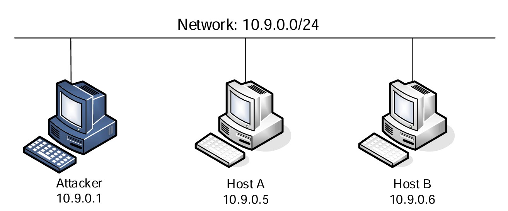

> The network has an IP prefix of  `10.9.0.0/24`, where `/24` represents the Subnet mask. This Subnet mask indicates that the first 24 bits of the ip address are the network bits, while the remaining 8 bits indicate which host (machine or server) in specific we want from that network.


The VM will have an IP address of `10.9.0.1`. Since the attacker container needs to sniff packets from all the interfaces of the network, then we will put the attacker container in the same namespace as the host VM. This means that attacker container will have the same IP addresses as the VM, but still remains a seperate container as its other namespaces are different. Generaaly, to do this, we will use host mode in the attacker container: 

```sh
network_mode: host
```

The VM will also have a shared folder to all the connected containers. The ./volumes folder inside the VM will be useful to pass our code files to the ./volumes inside each container. Having a direct access to the files means it will be easy to edit and write the attack code:

```sh
volumes:
        - ./volumes:/volumes
```

To have successful attacks we need to redirect our code to the network interface, which requires us to have the name of the interface.The interface name is the concatenation of br- and the ID of the network created by Docker. To find the name of the network interface that is on the VM, we can do 2 commands:

1) `ifconfig`- lists network interfaces. The IP address is `10.9.0.1`.

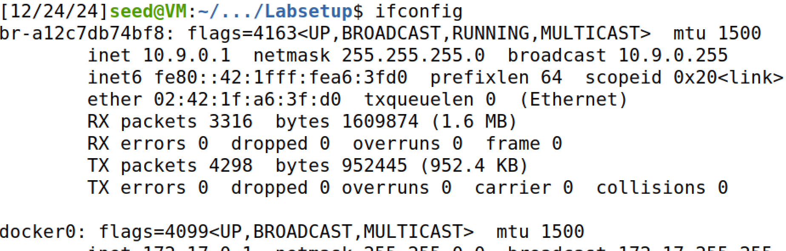

2) `docker network ls` - lists among other things the network ID. The name of the network is `seed-net`.

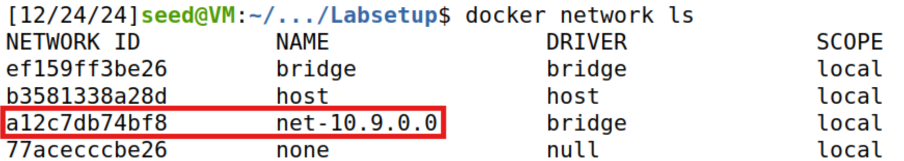

We can conclude the name of the network interface inside the VM is `a12c7db74bf8`.

### 2º Prepare the environment

Preparing the environment is easy as we only have to follow the same steps done in the previous logbooks.

We make `dcbuild` or `docker-composebuild` to build an environment container, and `dcup` or `docker-composeup` to start the container. The aliases are inside .bashrc file.

In another terminal, we made `dockps`, alias for `docker ps`, and see that there are three hosts available: attacker host, host A, host B. We do `docksh <id number of host>` in three different terminals, to set up the connection to each host.

### 3º Tools to use

We will use `Scapy` tool inside the Python programs to help us to sniff and spoof the packets. 

```python
#!/usr/bin/env python3   #to import python library

from scapy.all import * #to import all Scapy's modules
```

In addition, we will use `Wireshark` as a sniffing tool. Though popular and easy to use, it isn't as pratical to build sniffing programs like Scapy.

## Task 1: Sniffing Packets

To sniff packets on our VM interface, we will use the following code provided in the lab:

```python
#!/usr/bin/envpython3
from scapy.all import *
def print_pkt(pkt):
    pkt.show()
pkt = sniff(iface = 'br-c93733e9f913',filter='icmp',prn = print_pkt)
```

- iface: the interfaces we want to sniff: ex.: ` iface=['br-c93733e9f913','enp0s3']`

- filter: the type of packets we want to sniff. In this case, we will get icmp packets.

- prn: the function we will redirect the sniffed packets. In this case, print_pkt will print the packets.

For our code to work, we will substitute the name of the interface to be the one we got before:

```python
pkt = sniff(iface = 'br-a12c7db74bf8',filter='icmp',prn = print_pkt)
```

### A - Running the sniffing code

For the sniffing and spoofing programs to work, we have to run them with root privilege.

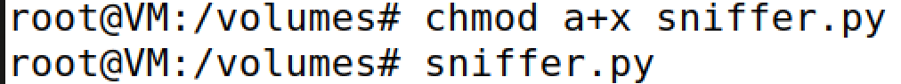


If we ping host B from host A:

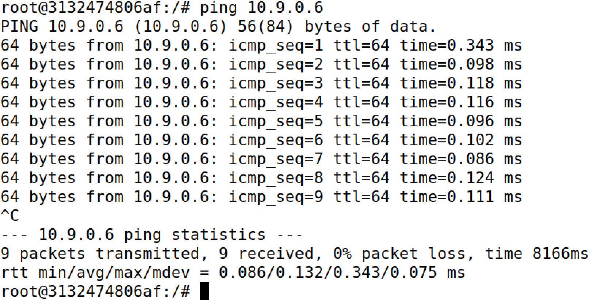


The result will be the print out of the multiple sniffed packages with the following format:

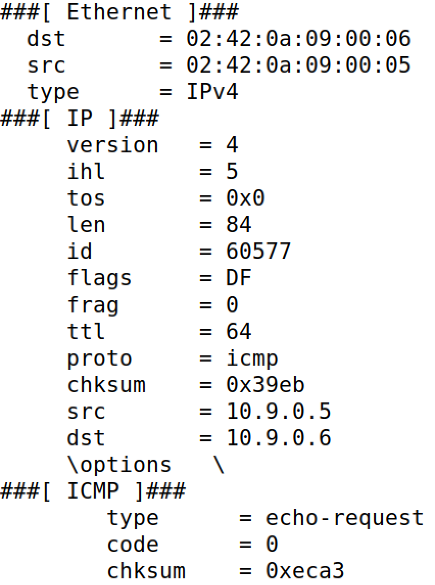
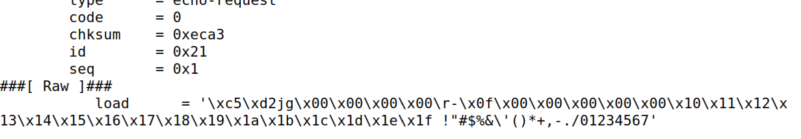


However, if we try run the code without root privileges:

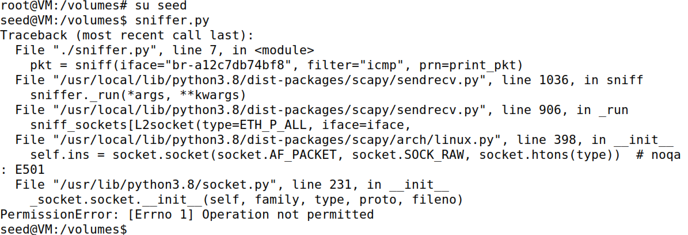

We will be informed that `Operation not permitted`. The packets weren't sniffed, because this operation requires elevated privileges.

### B - Running the sniffing code with BPF syntax filters.

The previous code runs a Scapy's filter to only let through ICMP packets. Nevertheless, if we are interested in broadening or stricting the types pf packets we get, we have to use different filters. To set the filters in Scapy, we have to follow the BPF(Berkeley Packet Filter) syntax. 

#### - Capture only the ICMP packet

We use the same code as before:
```python
pkt = sniff(iface = 'br-a12c7db74bf8',filter='icmp',prn = print_pkt)
```

#### - Capture any TCP packet that comes from a particular IP and with a destination port number 23.

For this example, we have to dig deeper in the manual. Based on [this website](https://biot.com/capstats/bpf.html), we can conclude:

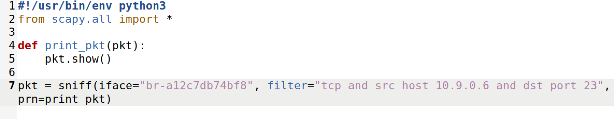

- `tcp` : only captures TCP packets
- `src host 10.9.0.5` : only captures packets that are sent from the Host B, with IP address being 10.9.0.6
- `dst port 23`: only captures packets whose destination is the port 23.

Sending a message by Host B:

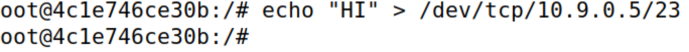

We get 3 packets with the format:

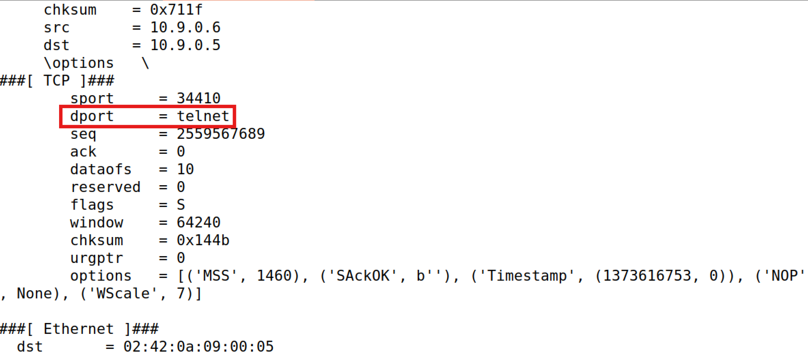

> As we can see from looking at the picture, the destination port is `telnet`, which is normally located at theport 23. This ensures that our packet sniffing was successful.

#### - Capture packets that come from or to go to a particular subnet.

For this step, the guide mentioned not to use the VM subnet we are using for the hosts. Which means, we have to find a subnet in our VM that isn't `10.9.0.1`. If we look more in the `ifconfig` list, we will find other subnets we can use, such as:

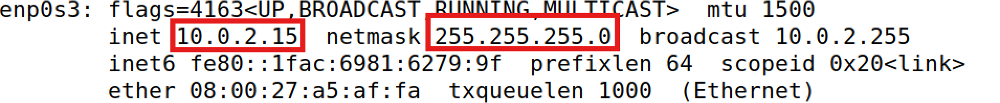

This subnet is represented by the IP address prefix of `10.0.2.0/24`.

> Note
`225.225.225.0` is the same as `/24`

Therefore, the filter to only capture packets of this subnet is the following:

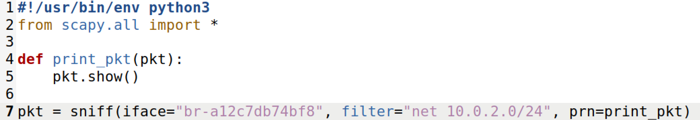

- `net` : only captures packets of that subnet. In this case to or from subnet `10.0.2.0/24`.

If we try to ping from hostA the subnet `10.0.2.0/24`:

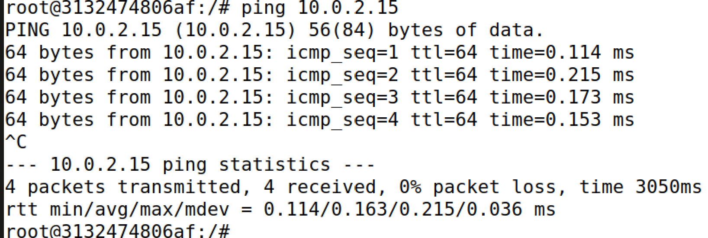

And sniff the packets, we will get packets with this format:

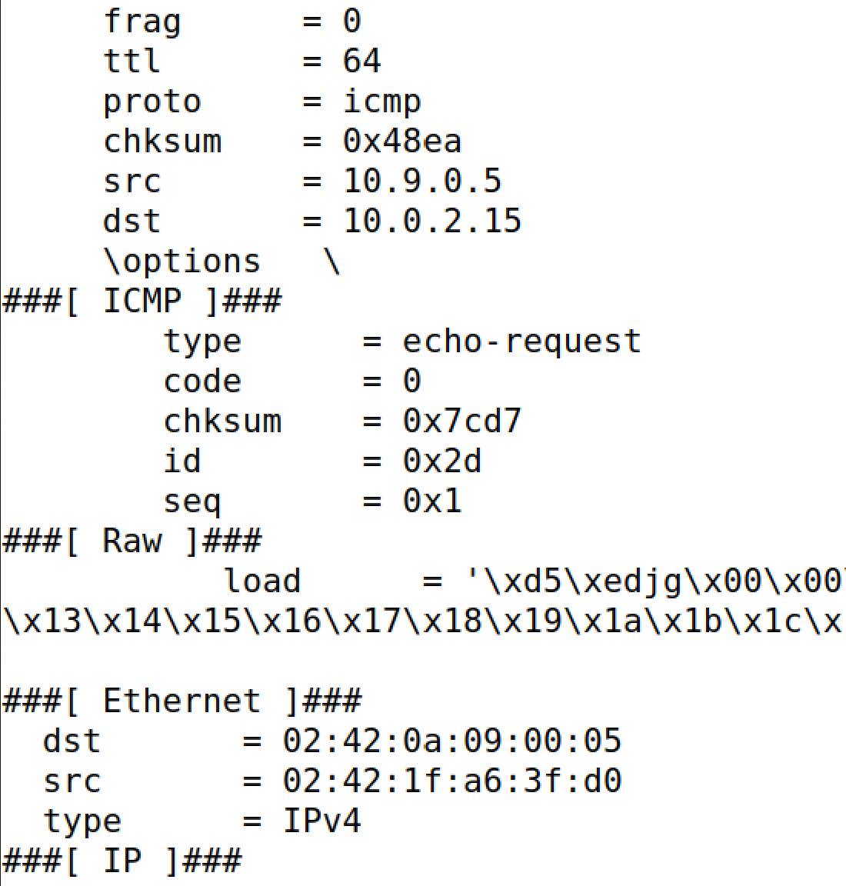

## Task 2: Spoofing ICMP Packets
On this task, the objective is to spoof packets coming from an arbritary source IP address. In more detail, we will focus on spoofing ICMP echo request packets, so that they are delivered in another host of the same network.

> Spoofing packets means change changing fields of captured packets into values we desire. 

We will use the code provided in the lab to complete this task:

```python
from scapy.all import *

a = IP()                   #creates an IP object from the IP class
a.dst = ’10.0.2.3’         #set the destination IP address field
b = ICMP()                 #creates an ICMP object. The default type is echo request
p = a/b                    # p is the same as a but has the data fields modified by b
send(p)                    # sends packet p
```

We can also view the list of attributes of the IP class by: `ls (a)` or `ls(IP)` or `a.show()` or `IP.show()`.


If we look closely, above dst fiel, we have src IP field, which can be useful to impersonate an host.

We can alter the previous code to spoof the required packets:

```python
#!/usr/bin/env python3
from scapy.all import *

a = IP()
a.src = '10.9.0.5'                  
a.dst = '10.9.0.6'       
b = ICMP()                 
p = a/b                   
send(p)                   
```

Before start running the program, let's not forget to make the program with root privileges:

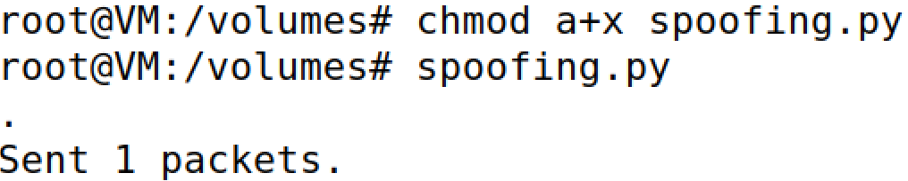

If we look through Wireshark while executing the program, we notice two ICMP packets. The first one is the echo request we created. It is being delivered to Host B, which in turn, accepts the request. Thus, an echo reply packet is sent to the spoofed IP address, which belongs to Host A, even though he didn't send any request to Host B.

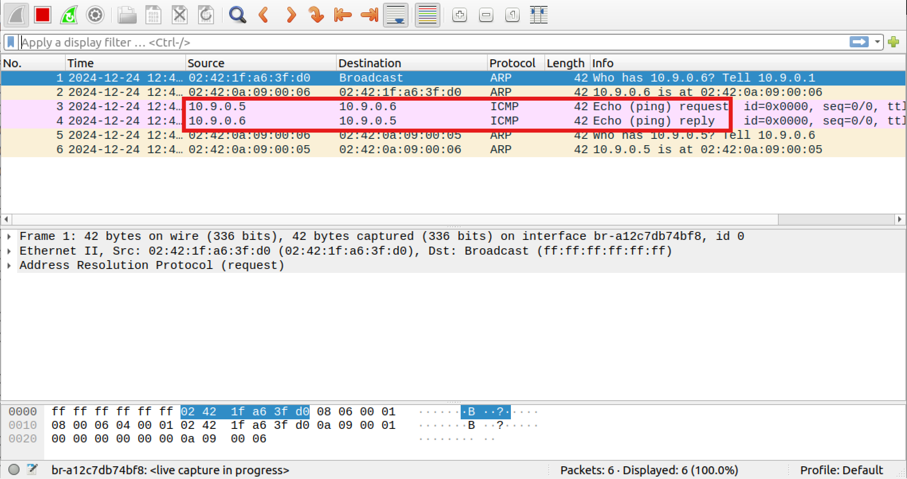

In summary, we were able to impersonate Host A. It was a successful attack.

## Task 3: Traceroute
In this task, we have to create a program, so that it counts how many routers one packet passes through before reaching its final destiination. This is the same as what the `traceroute` does.

The program must do the following:

Send a packet to a destination, for example, to Google address `8.8.8.8.`. The packet must initially have the field named `Time-To-Live (TTL)` with the value 1. The first router will drop the packet and send an `ICMP error message`, telling us that the time-to-live has exceeded. Then, we will increase the ttl value and send the packet again, until we stop getting ICMP error messages. This mean, our packet reached the final destination and we will get ______________. If we get that message and have seen how big the ttl value is, we know how many hops or how many routers we came across the journey. Thus, the distance is calculated.

After some more search, we come across some useful information:

- `sr1` - it has the same function has `send()`, but also returns the first reply packet (the response for the packet we sent).

The types of reply packets we could get from the packet we sent are the following:

- `None` - when the timeout of sr1 is over, it returns None. Which means we need more TTL to reach a router.

- `reply.type == 0` - when the type of reply is 0, it means the packet is a ICMP Echo Reply (not request). This is what we are looking for.So, whenever we get this reply, we must stop the cycle, and return the answer.

- `reply.type != 0` - it means other types of replies we aren't looking for like the drop message. If we encounter them, we have to continue increasing the TTL value until we find the final destination.

With this in mind, we developed the code:

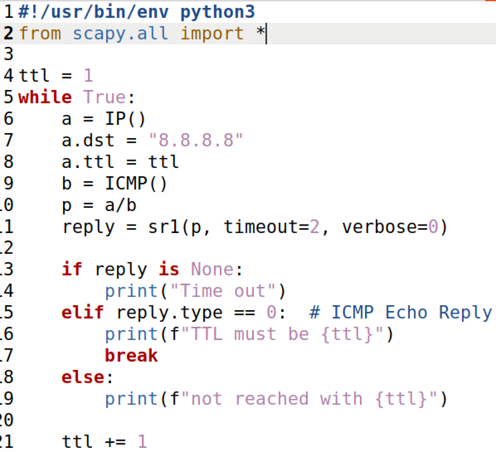

After making sure we execute the code with root privilege, the result is:

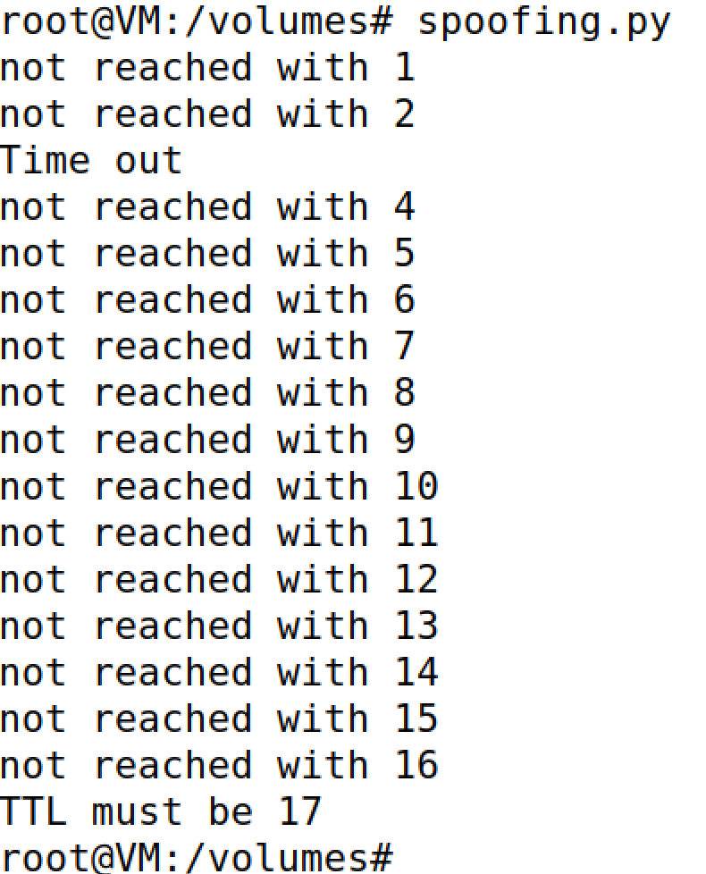

We can conlcude the final destination, `8.8.8.8` is in a distance of 17. We can verify it by doing the normal traceroute function:

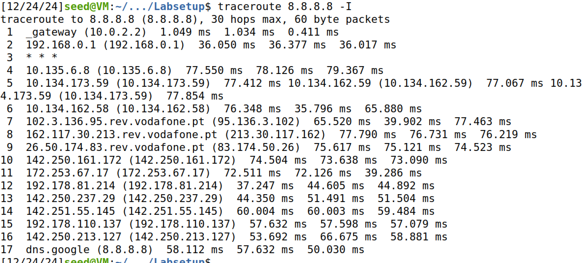

Which also returns the awnser of 17, confirming our solution and code.

## Task 4: Sniffing and-then Spoofing

In the final task of the last LOGBOOK, we have to execute a program that captures an `ICMP echo request packet` that is traveling between 2 machines of the same LAN. Then, we have to forge an `echo reply` and send it to the source machine as if the packet was sent from the true destination host. In other words, we have to make the victim machine believe that the destination host is always alive, whether it is real or a lie.

To forge the echo reply, we will need more knowledge. Digging more through the internet, we can find:

- `packet[ICMP].type == 8` - to verify we only send replies to packets that are `ICMP echo request`.

- `packet[IP]` - we can get information related to the destination and source hosts. `packet[IP].src` and `packet[IP].dst` will be used to assing the reply packet with the according source and destination we want.

- `type = 0` - as seen in task 3, is to indicate that the packet is an echo reply

- `packet[ICMP].id` and `packet[ICMP].seq` - these values are important to surpass the security, hence not be detected as problematic.

- `packet[Raw].load` - copies the data from the original packet to the reply. Although seems irrelevant, the code wouldn't work without it.

Therefore, we reached the final code to be:

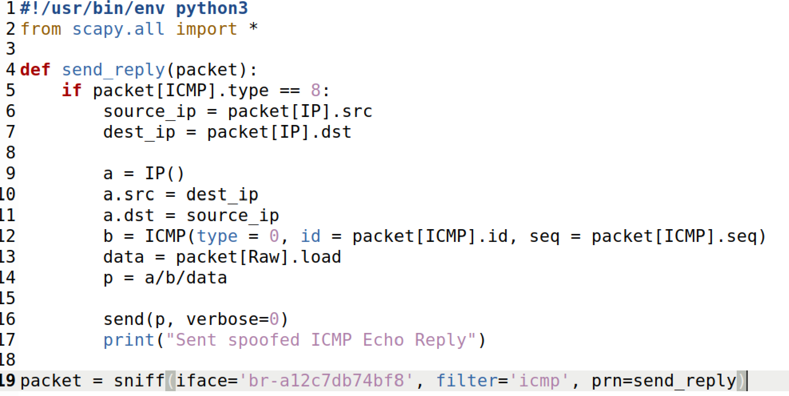

After putting the code with root privileges, we execute and see the results from three different scenarios:

1)  `ping 1.2.3.4` -  a non-existing host on the Internet
2) `ping 10.9.0.99` - a non-existing host on the LAN
3) `ping 8.8.8.8` - an existing host on the Internet

> Note: We will ping from Host A.

#### Scenario 1 - `ping 1.2.3.4` -  a non-existing host on the Internet

In Host A, we ping the IP address 1.2.3.4 :

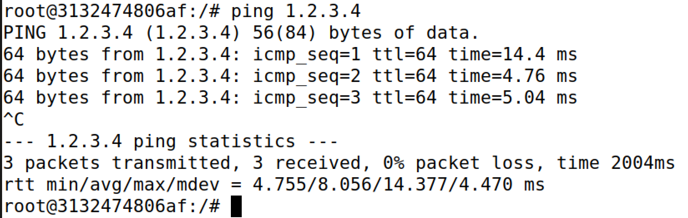

From reading the image, 3 packets were transmitted. Besides, 3 packets were also received. Lets see if it was us:

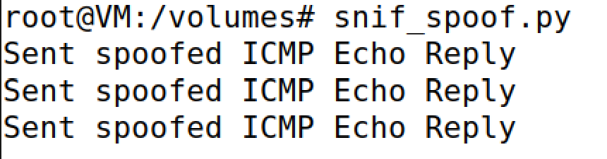

It was us, but lets check through Wireshark how the packet flow looks:

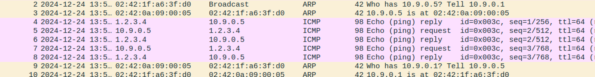

After each request packet, a reply packet follows. Meaning the code we are executing captures the request packet, forges a reply packet, and host A receives it without problems. A sucessful transmission.

But why it works? Well, we have to focus on the first ARP messages to fully understand.

> The network uses `ARP protocol` to deliver packets between hosts. Each host not only has an IP address, but also has an `MAC address` - a fixed physical machine addres.

> To deliver a packet to an IP address, the `ARP protocol`, also known as `Address Resolution Protocol `, pairs each IP address to its MAC address in a table. Whenever there is a packet to deliver, if the IP is known, then they will deliver to the corresponding MAC.

> However, if the destination IP is not known, by the `ARP protocol`, the machine will send a `broadcast packet` to discover the receiver's MAC address. In other words, it will send the packet to every host in the network, and whoever was the destination address will notify the machine to update the ARP table with the new IP and MAC address.

If we look carefully in the logs, we see the first message was a broadcast packet. It is interested in knowing what MAC address has the host `10.9.0.1`. Wait, that address belongs to the `attacker machine`. **Why does it want to deliver the packet to the attacker machine before the final destination?**

Well, for that we need to know the route that the packet from Host A is taking to reach 1.2.3.4. We can see the first route by executing the command:

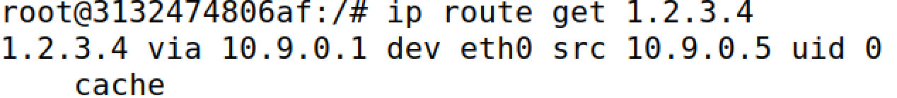

It looks like the packet needs to be sent first to the attacker machine to reach 1.2.3.4. This is due to `1.2.3.4` not belongging to the same network. This means it is easy to the attacker machine to get the packet and sent a reply.


#### Scenario 2 - `ping 10.9.0.99` - a non-existing host on the LAN

In Host A, we ping the IP address 10.9.0.99 :

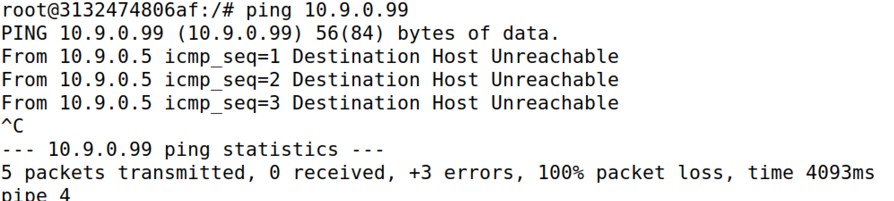

From reading the image, 3 packets were transmitted. In the contrary, no packet was received by Host A. Wireshark confirms the same:

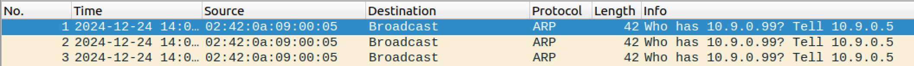

Wireshark showcases a broadcast to find the MAC address of 10.9.0.99. Since ` 10.9.0.99` belongs to the same LAN, then it doesn't need to be passed through the attacker machine, **failling** the transmission of echo reply. We can confirm the route of the packet:

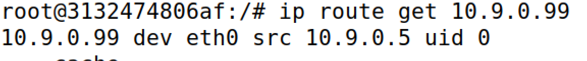

#### Scenario 3 - `ping 8.8.8.8` - an existing host on the Internet

In Host A, we ping the IP address 8.8.8.8 :

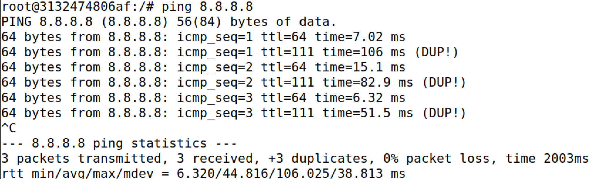

From reading the image, 3 packets were transmitted. In addition, 6 packets were received but 3 of them were duplicates of the other messages. Why there are duplicates? The reason is simple: 

- 3 packet replies were sent by `8.8.8.8`, since it obtained the request packet and `8.8.8.8` is an existing host.

- The other 3 packet replies, were forged and sent by the `attacker machine` when it captured the request packet. Since the final destination addresss is outside LAN, then the request packet had to go through the attacker machine, hence being sniffed. It says they are duplicates because we are copying the exact data onto the forged replies (including the source of the reply), as it would be in an original reply.

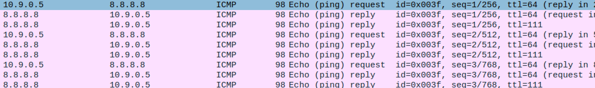

We can check that the request packet has to go through the attacker machine:

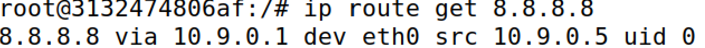

Yes, it was a successful transmission. But we weren't the only ones transmitting, which could raise some flags...