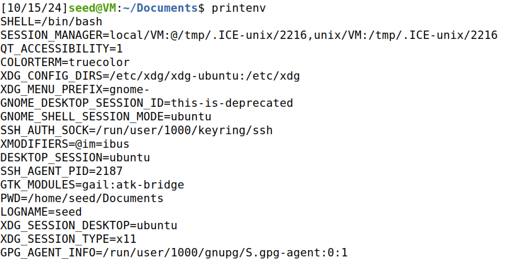
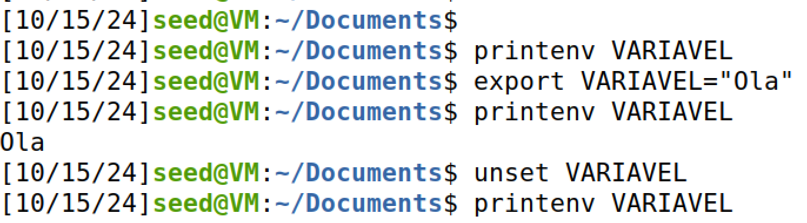
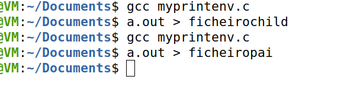
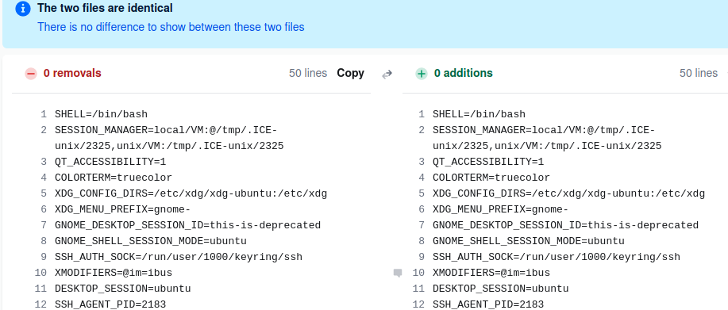
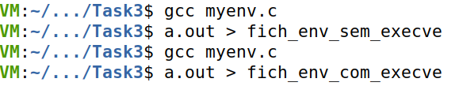
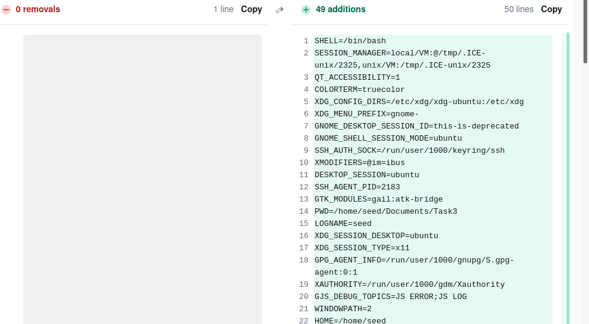
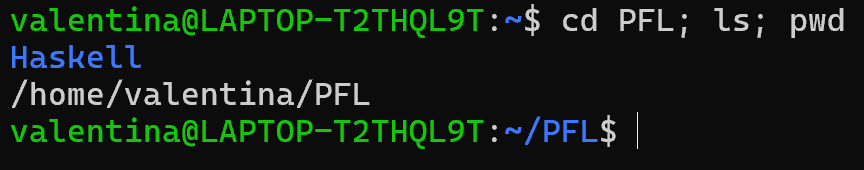

# SEED Labs Tasks for _Environment Variable and Set-UID_

## (Work done in Week #4)

## Task 1: Manipulating Environment Variables

In this week's first exercise, we were asked to understand how environment variables work, particularly print, export and unset variables.

For the first part of this task, we are using `printenv` to print the current environment variables in the default shell, set in the /etc/passwd file.



Image 1: First few lines of printenv

Now, to export and unset an environment variable, we created a new variable called `VARIAVEL` with the content `"Ola"`. We concluded that, after an environment variable is unset, all its content will disappear. Furthermore, we can't unset an important environment variable, such as PATH.



Image 2: Usage of export and unset to manipulate environment variables

## Task 2: Passing Environment Variables from Parent Process to Child Process

In this task, we will understand how `fork()` influences environment variables. We executed the code provided in the guidelines and noted the differences if we used the `printenv()` function in the child process versus in the parent process.



Image 3: Compiling the code files and saving their output in their respective files

Having saved both files and compared their content using the `diff` command, we found that the files were identical. This confirms that environment variables are copied when a new process is created. This happens because the parent process copies its address space for the child process. Once the child process runs, it can modify its environment variables independently (without affecting the parent’s address space)



Image 4: Using [this](https://www.diffchecker.com/text-compare/) website to visually enhance the (lack of) differences between the files

## Task 3: Environment Variables and _execve()_

We learned that copying a new process using `fork()` will maintain the environment variables. Nevertheless, the execve() will not have a similar inheritance. To prove this fact, we will compile and run the given code in the guidelines twice. However, the first version will call `execve("/usr/bin/env", argv, NULL)` and the second one will call `execve("/usr/bin/env", argv, environ)`.



Image 5: Compiling the code files and saving their output in their respective files

Using the `diff` command between the two files, we noticed that the first output file would be empty, whereas the second one would have the same environment variables as if `printenv` was executed.



Image 6: Compiling the code files and saving their output in their respective files

The last parameter of `execve()` has the following type: `char *const envp[]`, which is a char vector containing the environment variables that we want to pass to the new program running in the current process - that new program is in the first argument of the function, `/usr/bin/env` in this case, which is used to print out the environment variables of the current process. The difference between the outputs resides in the last parameter changing from `NULL` to `environ`:

- In the first code example, the `execve()` function ran the code without any environment variables due to the `NULL` argument, leading to the printing of no environment variables.

- On the other hand, the `environ` argument passed all the environment variables before running `/usr/bin/env`, which made it possible to print the environment variables correctly.

## Task 4: Environment Variables and _system()_

Conversely, the `system()` function does not require additional arguments to acquire the environment variables since its internal process uses a temporary `fork()` to obtain them from the parent process. Additionally, during the `fork()`, the `system()` executes `/bin/sh -c command` through `execl()`, being able to run advanced shell resources and sequential lines of commands.

The capability of `system()` is visible by running the following code:

```sh
#include <stdio.h>
#include <stdlib.h>

int main(){
  system("/usr/bin/env");
  return 0 ;
}
```

As expected, we obtained the environment variables of the above code:

```sh
GJS_DEBUG_TOPICS=JS ERROR;JS LOG
LESSOPEN=| /usr/bin/lesspipe %s
USER=seed
SSH_AGENT_PID=2183
XDG_SESSION_TYPE=x11
SHLVL=1
HOME=/home/seed
OLDPWD=/home/seed/Documents
DESKTOP_SESSION=ubuntu
...
```

> Note: Since `system()` returns to the parent's process, any code written below the `system()` call will be executed, whereas in `execve()`, the remaining code will not be executed, due to the process image being replaced when the new program is run. This could be detrimental for execve(), when choosing which one of the functions to use.

## Task 5: Environment Variable and Set-UID Programs

To establish a better understanding of the shell capabilities, mainly executing with root privileges, we saw how a Set-UID program runs.

The code we compiled named ver_en_var prints the environment variables that are passed through the shell:

```sh
#include <stdio.h>
#include <stdlib.h>

extern char **environ;
int main() {
  int i = 0;
  while (environ[i] != NULL) {
    printf("%s\n", environ[i]);
    i++;
  }
}
```

Then, we change its ownership to root to transform it into a Set-UID program:

```sh
sudo chown root ver_en_var
sudo chmod 4755 ver_en_var
```

Next, we altered/created some of the environment variables (PATH, LD_LIBRARY_PATH, ANY_PATH_NAME), to verify if they were visible during execution:

- Added the following to PATH: "/meu/novo/caminho"
- Modified LD_LIBRARY_PATH to: "/minha/biblioteca"
- Created ANY_PATH_NAME: "/meu/diretorio/personalizado"

When we ran the program, we confirmed that some environment variables were visible, such as:

```sh
...
ANY_PATH_NAME=/meu/diretorio/personalizado
...
PATH=/usr/local/sbin:/usr/local/bin:/usr/sbin:/usr/bin:/sbin:/bin:/usr/games:/usr/local/games:/snap/bin:.:/meu/novo/caminho
...
```

However, `LD_LIBRARY_PATH` was not shown on the obtained output. Searching in depth for the root of the problem, it is likely that the system deemed our code vulnerable to exploitation by having access to the variable `LD_LIBRARY_PATH`. Of course, if we ran this code with no higher privileges than the normal user, then that variable exposed would not be relevant, as we would not have enough permissions to do any successful attack.

## Task 6: Manipulating Environment Variables

For the next task, we had to gather all the above information to run our malicious code. The following steps detail the procedure to accomplish it:

1. We created a file named `ls_relative.c`:

```sh
int main() {
  system("ls");
  return 0;
}
```

2. Besides, we inserted our malicious code, `ls.c`, in a separate folder - `home/seed/Documents/HAKERSCRIPTS` - for better accessibility:

```sh
#include <stdio.h>

int main() {
  printf("olá! Queres um presente?");
}
```

3. We compiled both programs and transformed the `ls_relative` executable file into a Set-UID program.

```sh
sudo chown root ls_relative
sudo chmod 4755 ls_relative
```

4. Then we had to prepare our PATH environment variable by changing the priority of where the system tries to find the `ls` program. This is possible by adding our malicious directory before the rest of the already existing PATH value. Afterwards, if we try to execute the command `ls` or `./ls_relative`, our malicious code will run, instead of listing the contents of the directory.


Image 7: Path and execution of `ls` **before** and **after** changing the PATH environment variable

> Notes: If we try executing ls in /bin/sh program, it won´t work as /bin/dash will deactivate the root privileges as a security measure, and thus, stop the execution of our code. Before step 4, it is necessary to link /bin/sh to /bin/zsh: `sudo ln -sf /bin/zsh /bin/sh` and then `zsh`

## Task 8: Invoking External Programs Using _system()_ versus _execve()_

According to the observations of Task 4, we already know that the use of `execl()` inside the `system()` function deliberately allows sequential commands to be written as one whole argument on the function. This is due to the shell feature of processing multiple commands using `;` to distinguish where each command ends.



Image 8: Example of running sequential commands

If we were Bob, we could take advantage of this vulnerability, and try to remove any file we wanted, including files that otherwise we did not have permissions to write. That is possible through the use of `catall.c`, a Set-UID program with root permissions (given by us, to follow the Bob story at the start of Task 8). This means that it can read/write/execute any file available. As a consequence, using the program to remove the files for us is feasible.

This is possible due to the implementation of the `catall.c` file, which uses a `system()` call to execute the command through the shell. If, in the argument that we provide to `catall.c` (intended to be a file path to see the contents of), we use shell special characters like `;` we can inject malicious commands to execute functionalities beyond what is expected by that program.

For instance, instead of the intended way to execute `catall.c`:

```sh
./catall "path/do/ficheiro/para/ler"
```

We could run the following command:

```sh
./catall "ficheiro_pouco_importante; rm -f /path/do/ficheiro/muito_importante"
```

Or even be more destructive:

```sh
./catall "ficheiro_pouco_importante; rm -rf ~/*"
```

This would delete ALL files and directories Vince would have in the system, completely ruining the system.

Nevertheless, if we use `execve()`, instead of `system()`, our exploit would not work, even with it being a Set-UID program. This is because `execve()` can only replace the address space of the current program once, which means, it only executes the first command and ignores the rest of the inputted string. Since `/bin/cat` only has one argument, then it captures the first input of the user, which must be a valid file path. After the program captures a viable input, it starts the process from zero, executing `cat filename`. The rest of the string, `; rm ~/*`, would be erased from the memory. Hence, no effects would be felt in the system.

In summary, having `catall.c` execute with the `system(command)` call is vital for our exploit in Vince's system.
