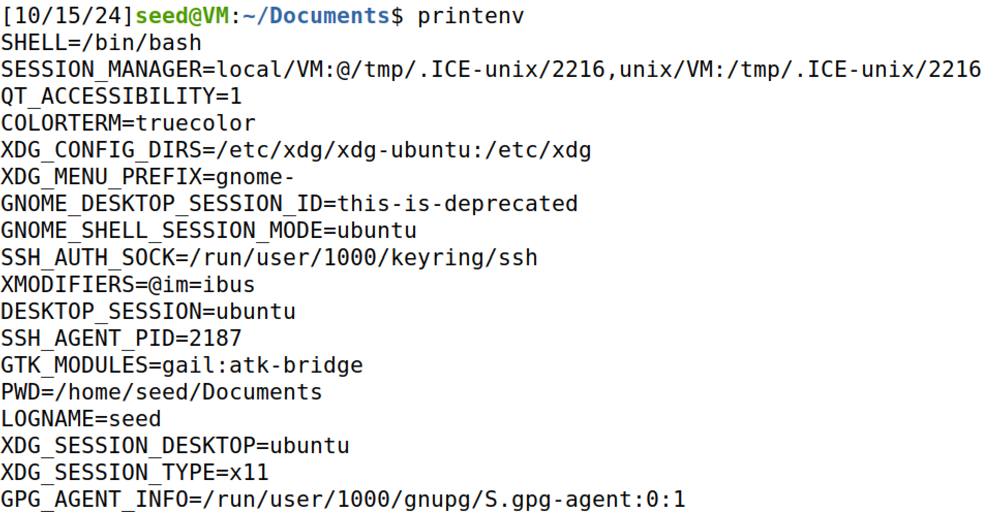
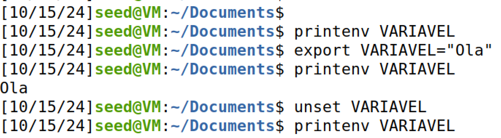
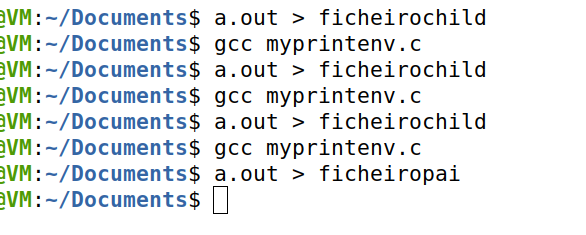
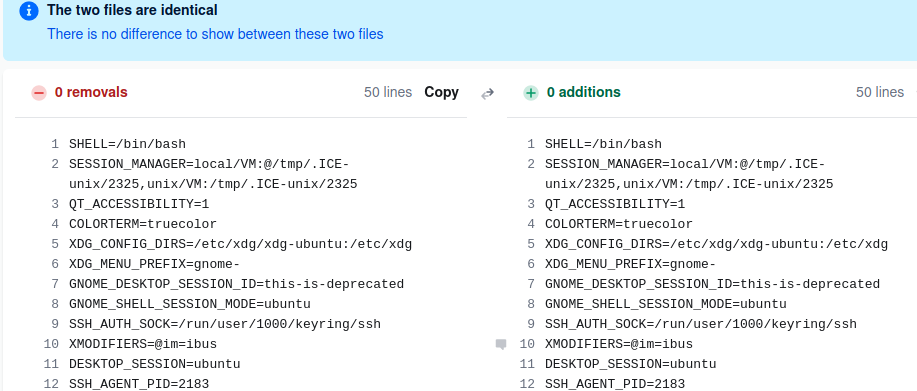
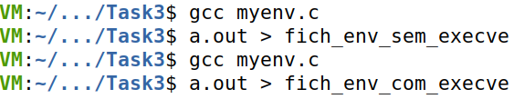
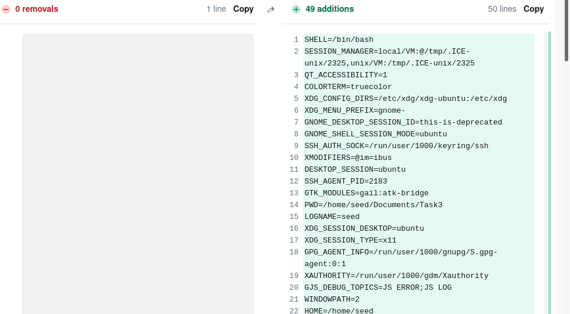
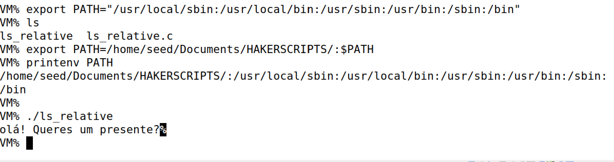

# Lab Tasks for _Environment Variable and Set-UID_
## Task 1: Manipulating Environment Variables
In the first exercise of the week, we were asked to understand how environment variables work, in particular, to print, export and unset variables. 

For this process, we are using `printenv` to print the current environment variables in the default shell, set in the /etc/passwd file. The beginning of the print will look similar to the following image:



Now to export and unset an environment variable, we chose to create a new variable called `VARIAVEL` with content as `Ola`. We conclude, after an environment variable is unset, all its content will disappear. Besides, we can't unset an important environment variable, such as PATH. 



## Task 2: Passing Environment Variables from Parent Process to Child Process
On this task, we will understand how `fork()` will influence environment variables. We executed the code provide in the guidelines, and see what are the diferences if we execute `printenv();` whether in the child or parent process.



Saving both files and compared their content using `diff` (using website diff only to enhance the diferences), we concluded that the files are the same. Hence, the environment variables are copied when we call a new process. The reason behind this is due to parent process making a copy of the adress space for the child. After the child continues the process, it can change environment variables without modifying the parent adress space.



## Task 3: Environment Variables and _execve()_
We learnt that copying a new process using `fork()` will maintain the environment variables. Nevertheless, the execve() will not have a similar inheritance. To prove this fact, we will compile and run the the given code in the guidelines twice. However the first version will have `execve("/usr/bin/env", argv, NULL);` and the last one `execve("/usr/bin/env", argv, environ);`.



Making `diff` between the two files (using online diff to have diferences visible), we noticed that the first file will be empty, whereas the second fills the page with environment variables as if `printenv` was executed.



The difference resides in the last parameter change `NULL -> environ`. The last parameter of `execv()` is `char *const envp[]`, which is a char vector containning the environment variables that we want to pass to the new program running in the current process.

In the first code example, the execve ran code without no environment variables due to NULL, leading to the failure of execution, and, thus, printing no text.

In the other hand, environ passed all the variables before running /usr/bin/env which made it possible to print the environment variables correctly.

## Task 6: Manipulating Environment Variables
For the next task, we had to gather all the above information to run our own malicious code. The following steps detail the procedure to accomplish it:

1. We created a file named `ls_relative.c`:

```sh
int main(){
  system("ls");
  return 0;
}
```
2. Besides, we inserted our malicious code ,`ls.c`, in a seperate folder for accessability: `home/seed/Documents/HAKERSCRIPTS`
```sh
#include <stdio.h>

int main(){
  printf("olá! Queres um presente?");
}
```

3. We compiled both programs, and transformed the `ls_relative` exectutable file into a Set-UID program.
```sh
sudo chown root ls_relative
sudo chmod 4755 ls_relative
```

4. Then we had to prepare our PATH environment variable by changing the priority of where the system tries find the `ls` program. This is possible by adding our malicious directory before $PATH. Afterwards, if we try to execute the command ls or ./ls_relative, our malicious code will be processed.



> Notes: If we try executing ls in /bin/sh program, it won´t work as /bin/dash will deactivate the root privileges, and, thus stop the execution of our code. Before step 4, it is necessary to link /bin/sh to /bin/zsh: `sudo ln-sf /bin/zsh /bin/sh` and then `zsh`


