# SEED Labs Tasks for _ Format String Attack Lab_

## General Information

In this week, we learnt how to use a format string vulnerability to conclude an attack which would permit read and write variables inside the memory. Ultimately, we obtained knowledge in creating malicious scripts using pyhon and the command shell to affect the stack and the heap.

## (Work done in Week #6)

## Task 1: Crashing the Program

For the first task of the week, our objective is to crash the program using a string input, which will be redirected to the server using `echo hello | nc 10.9.0.5 9090`, and, thus, to myprintf() function. There are multiple ways to crash a string, but one of the easiest way is to do `echo "%s"`.

Let's see the effects of a normal input versus the previous command on the program:

#### 1º Start the server

Initialy we need to start running the server. We can do `dcbuild` instead of `docker-composebuild` to build an environment container, and `dcup` instead of `docker-composeup` to start the container. These aliases are inside .bashrc file.

Terminal A:
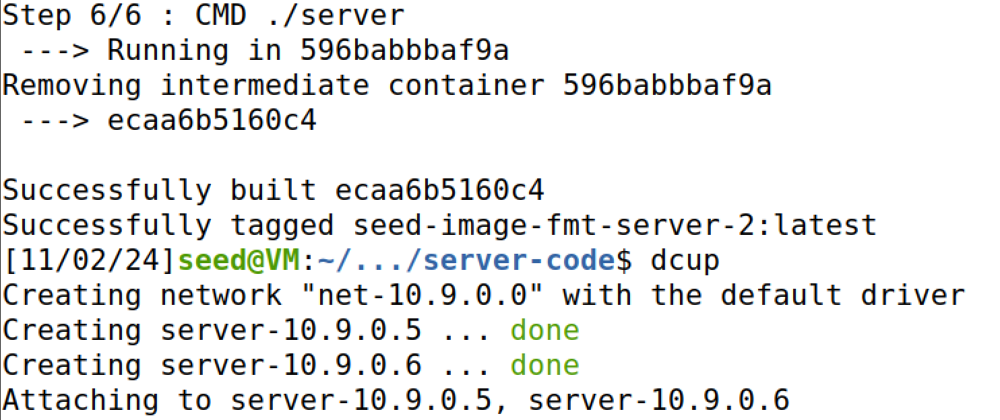

#### 2º Common input

Afterwards, we can start write a common hello string in a seperate terminal and see it appear with some adjacent related information on the server terminal.

Terminal B:
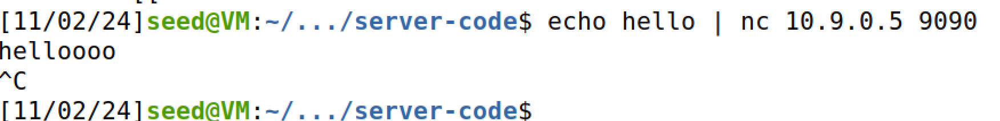

Terminal A:
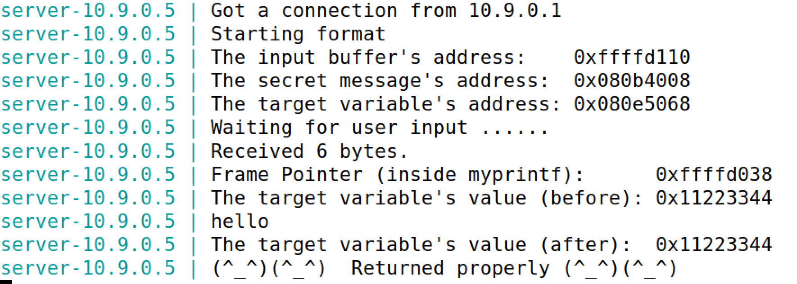

As expected, the program responds with the number of bytes writen as input, the print, and some key addresses we will use on the remaining tasks.

#### 3º Crashing program using malicious input

Adding `%s` is enough to make use of the string format vulnerability.

> Rebember: when we use `%s` in the command line, the code will try to read the content of the address mentioned on the stack, which could be not accessible. If we didn't had a vulnerability in the string format, then probably print would try to verify if the address we want is accesible, and block the attack.

Terminal B:
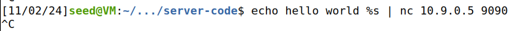

Terminal A:
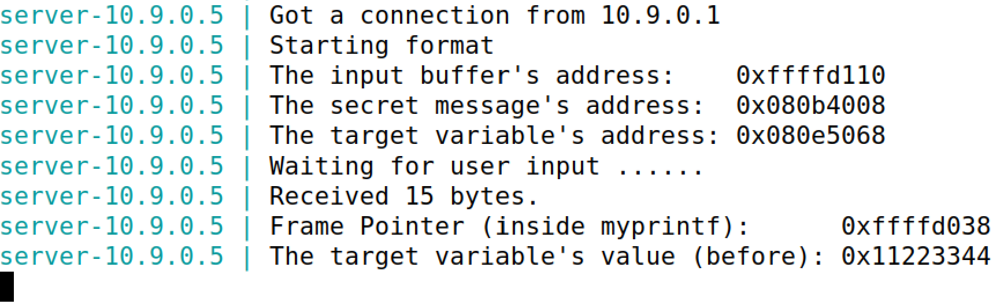

## Task 2: Printing Out the Server Program’s Memory

Using the secret message's address we can read directly what are its contents using `%s`. However, it's not as simple as printing `0x80b4008%s`, since we have to know where the first part of our input is located in the memory space - it could be anywhere in the stack, after all there might be other processes using the stack as well. We have to precisely detect where is the start, so when we place our special address there, we can 'move our pointer' to read that address, leading to the content showing in our screen.

#### Task 2.A: Stack Data.

Generally, we can do a simple brute force attack to see, how many %.8x or %08X do we need to do to reach our first input bytes on the stack. To notice better when our stack starts, we will add a small subtring "AAAA" in the beginning of the input. This will consume 4 bytes in total, which will show on the screen as 0x41414141

This will be helpful in the long run as well, because the number of %.8x will be the same number needed to do an attack in the heap.

After many, many,... and many tries, we finally reached a plausible number: 64 \* %.8x to read 0x41414141 - too many to count, seriously.

Terminal B:
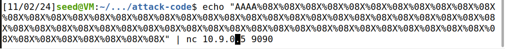

Terminal A:
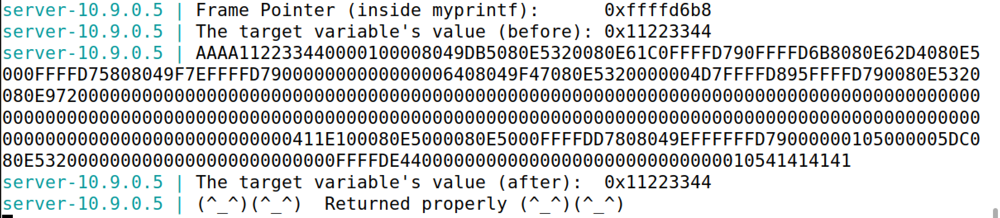

#### Questão 2

Na Task 2.A, e no programa vulnerável em geral, o ataque funciona porque a format string está ela própria a ser alocada na stack. Investigue o CWE-134. Tem que ser sempre o caso em que a format string é alocada na stack para existir uma vulnerabilidade? Das tarefas realizadas, quais ataques não funcionariam se a format string estivesse a ser alocada na heap e porquê?

Answer:
Doing a deeper search on the format string vulnerability, mainly on CWE-134, we can conclude that the format string doesn't have to be always on the stack, it can be also on the heap but it will have more restrictions.

For example, reading a certain amount of %x could become quite tricky as sometimes the program crashes, even if the number is low (as per our tries). Nevertheless, if we have the exact address, we can read and write its content. We will see in more detail in the next tasks. Of course, reading and writting anything in the stack is impossible from the heap.

#### Task 2.B: HeapData

After being successful on retrivieng the exactt position of the first stack bytes, we can now try read the data from inside the heap. For that, we will use a python script to objectify the string we will insert as input using `cat badfile | nc 10.9.0.5 9090`

The example code explains to us how to create our own string with size of 1500 bytes, which is the maximum required in the `myprintf()` function.

We will substitute the address given, by the secret message's address. We don't need to worry about the conversion to little endian since the code already does that for us.

We will also comment the substring section, since it isn't important to us, at the moment.

Ultimately, all its left is to know the exact number of %.8x we will need to acess before reading the last address with `%s`. We concluded before we needed 64 %.8x to read the first input bytes. Consequently if we remove the last %.8x by %s, we can read the content of the address in the first input bytes, which will be the secret message's address. In total, we will do 63 times %.8x, followed by %s:

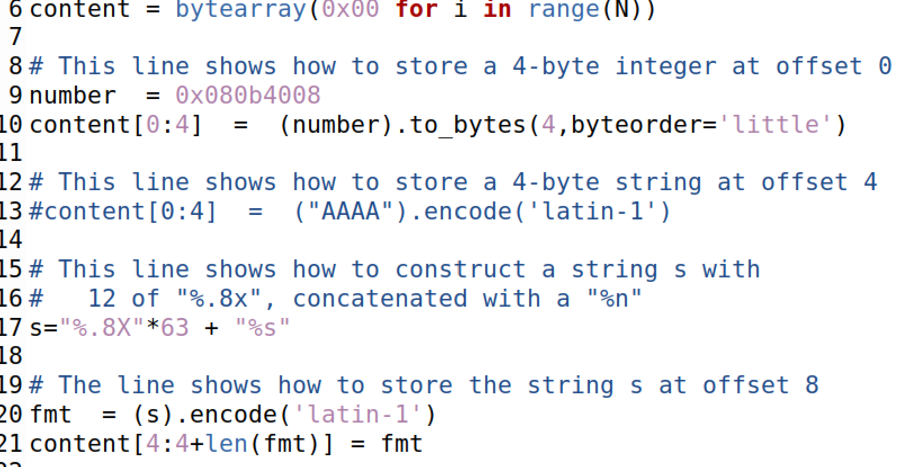

Compiled the python code and ran the command:
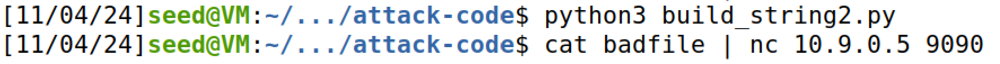

We obtain the secret message: "A secret message"
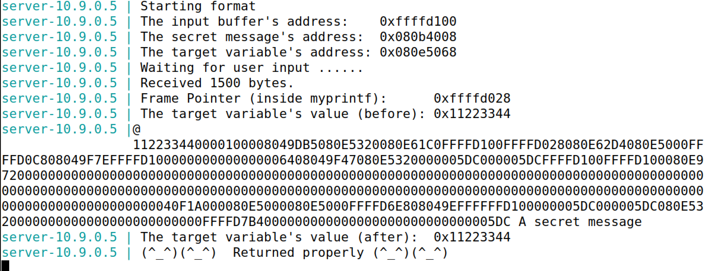

## Task 3: Modifying the Server Program’s Memory

#### Task 3.A: Change the value to a different value.

If we can read a memory in the memory, so can we write it, substituting %s for %n. This special character will write on the address given the number of bytes written at the moment %n is reached.

The code:
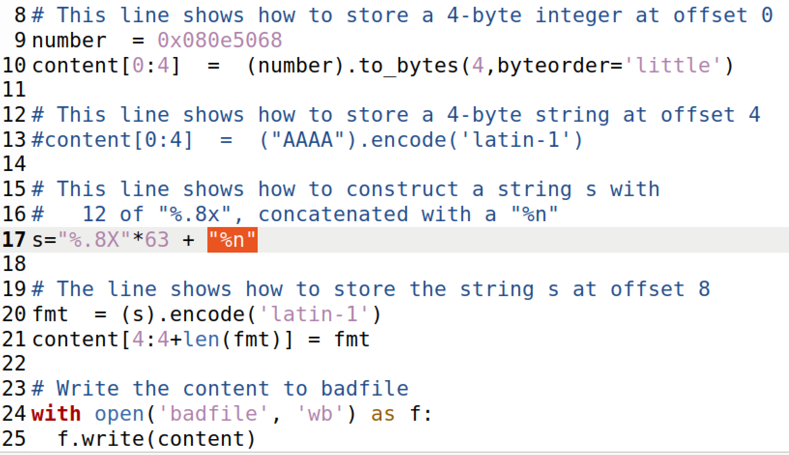

Terminal A: We can see after our message is written, the value of the target address has changed from 0x11223344 to 0x000001fc.
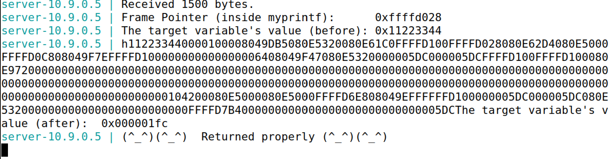

#### Task 3.B: Change the value to 0x5000

Nevertheless, on this task they want us to change to a specific value, in particular, to 0x5000. The hexadecimal value of 0x5000 in decimal is 20480, though we only have at the moment 508 from 0x000001fc.

We need to add more bytes before %n in the final string to reach 20480 bytes, but we still need to make sure we only have 63 %.8x to be able to write in the target address.

Adding chars or numbers seems to be not the best way (it will crash). There must be another way.

To complete this, there is a trick: we are using %.8x to write 8 bits for each address visible, so why not amplify that number (8) until we reach 20480? We can take the last %.8x and amplify it, though we need to make some calculations to get the number correct.

- We exclude the final one, the number of bytes are: 62 _ %.8x = 62 _ 8 = 496

- The address of the target consumes 4 bytes, so total will be: 496 + 4 = 500

- We need 20480, we have 500, the bytes we need are 19 980.

Adding that to the code:

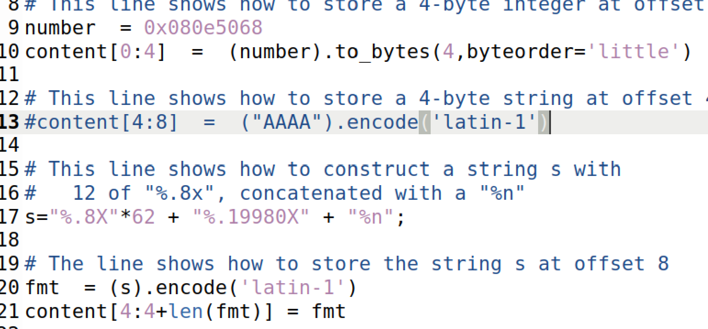

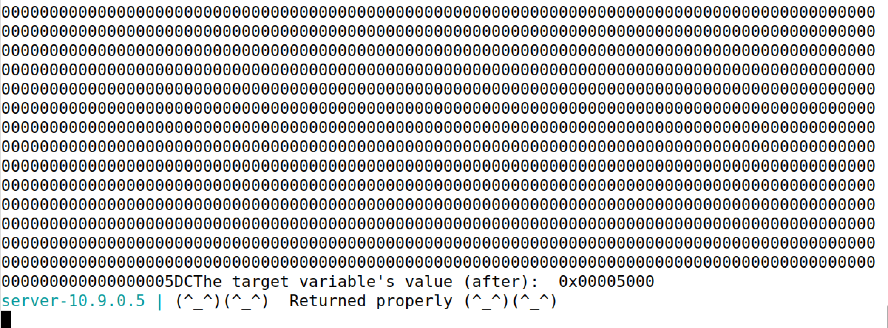

We can see that the final value was changed correctly!
